<p align="center">
  
</p>

<p align="center">
  <a href="#how-it-works">How it works</a> ·
  <a href="#quick-start">Quick start</a> ·
  <a href="#see-it-work">Tour</a> ·
  <a href="#time-travel">Replay</a> ·
  <a href="#performance">Performance</a> ·
  <a href="#deploy-by-copying">Deploy</a> ·
  <a href="docs/thread-monitor-design.md">Design</a>
</p>

## How it works

<p align="center">
  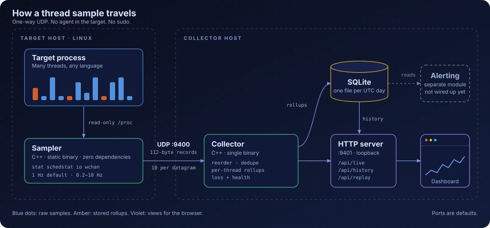
</p>

<p align="center">
  
</p>

## Quick start

<p align="center">
  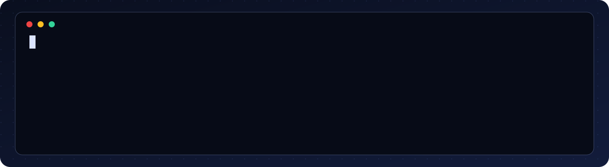
</p>

Then open <http://127.0.0.1:9401>.

<details>
<summary>Read more</summary>
Two programs: the **sampler** runs next to the process you want to watch and sends
its threads' stats over UDP; the **collector** receives them and serves the dashboard.
To build and start everything on one machine:

```sh
scripts/start.sh
```

The script creates `config/local/sampler.toml` and `config/local/collector.toml`
on first use, builds the sampler, validates the collector config, and starts both
programs. The local configs use loopback addresses, save history in `data/`, detect
the host's clock ticks, and leave webhook delivery disabled. Existing local configs
are preserved; running the script again leaves already-running services alone.

Open <http://127.0.0.1:9401>, click **Change target** next to the current target,
enter a process name or PID, and click **Monitor**. The change is saved in the
running sampler's config and applied without restarting it. Validation errors
appear in the form; a name that is not running yet is accepted and waits for it
to start.

Dashboard target control works with the local sampler started by `scripts/start.sh`,
a loopback HTTP listener, and Python 3 plus `scripts/sampler_control.py` in this
checkout. The collector and sampler must run as the same user, with write access
to the sampler's config. For remote samplers, use the script on the sampler host.

You can also select a target from the command line:

```sh
scripts/set-target.sh ghostty
scripts/set-target.sh 1234
```

The script edits the target line of the running sampler's config in place and
sends `SIGHUP` to reload it. Numeric arguments select a running process ID (not a
thread ID); other arguments select an exact Linux process name (up to 15 bytes).
A name that matches several processes is refused with their PIDs, because the
sampler treats an ambiguous name as an absent target. A name with no running
process is accepted, and the dashboard reports the target as absent until it starts.
Start the sampler with `scripts/start.sh` first. Run the scripts as the same user
as the target process. Open <http://127.0.0.1:9401>.

Change the thread sampling frequency without restarting:

```sh
scripts/set-rate.sh 5       # 5 Hz: one sample every 200 ms
```

The accepted range is 0.2–10 Hz. This updates the running sampler's config and
requests a reload, starting a new session. Higher frequencies increase sampling
overhead. The separate socket observer's one-second reporting interval is unchanged.

Both scripts check the edited file with the running sampler binary
(`triangulator-sampler --check-config`) before replacing it, so a change the
sampler would reject leaves the config untouched. They refuse to edit the tracked
examples in `config/`: start the sampler with `config/local/sampler.toml`, which
`scripts/start.sh` does by default.

```sh
scripts/stop.sh       # stop both
scripts/start.sh      # rebuild if needed and start both
scripts/restart.sh    # rebuild and restart the collector (also: sampler, all)
```

`scripts/restart.sh` reuses the config the running program was started with.
It rebuilds and checks the collector config before stopping anything, so a
build or config error leaves the old collector running. It finds the program
even without a pidfile. It will not touch a copy started by another user
(for example with `sudo`); stop that one yourself first.

The collector (`build/triangulator-collector`) does **no alerting**; see
[Alerting](#alerting).

Logs are in `.run/`; local configs are ignored by git. For separate hosts or custom
config paths, the optional `scripts/start.sh collector path/to/collector.toml` and
`scripts/start.sh sampler path/to/sampler.toml` commands remain available, along
with `scripts/stop.sh collector` and `scripts/stop.sh sampler`. To deploy with
systemd, see [Production setup](#production-setup).

</details>

## See it work

<p align="center">
  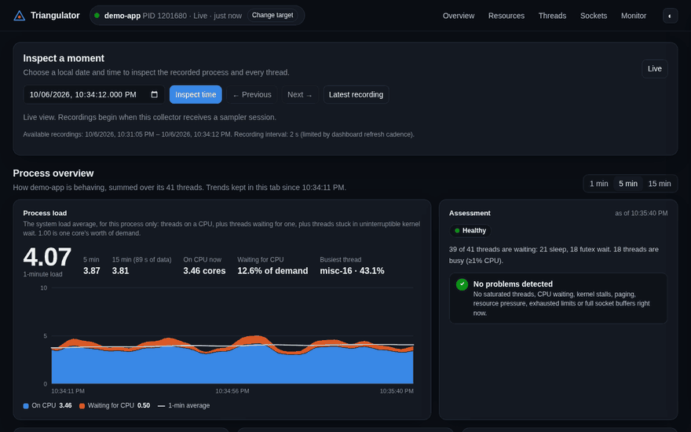
</p>

<table>
  <tr>
    <td width="50%">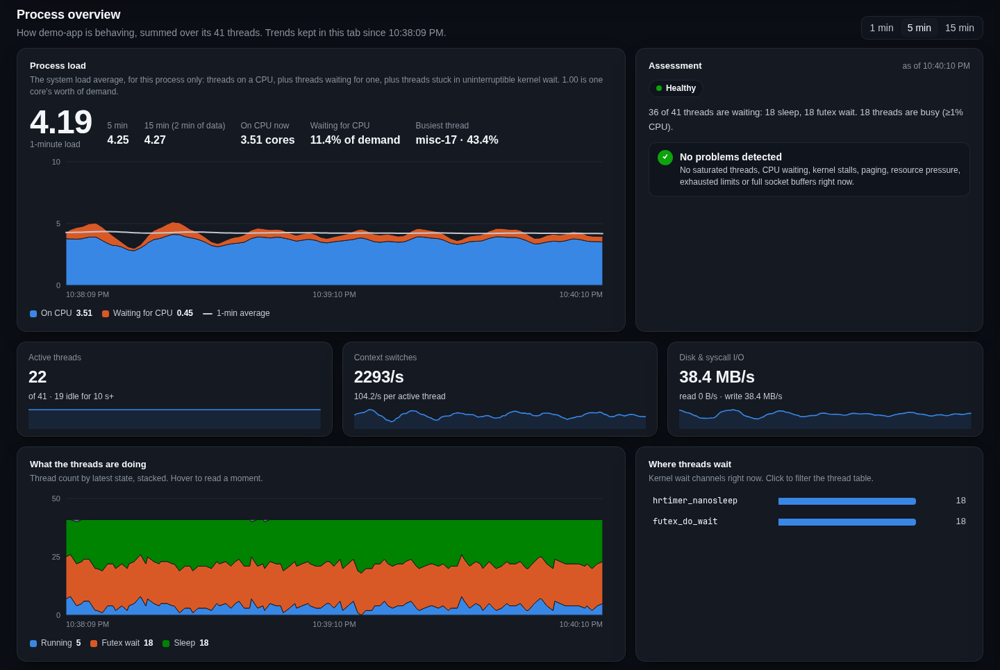</td>
    <td width="50%">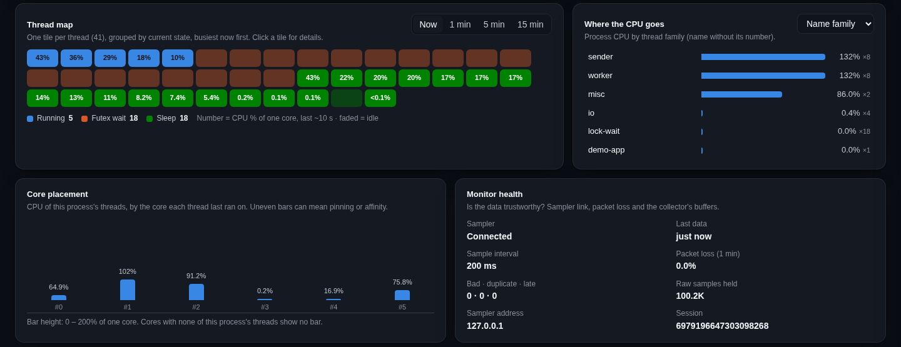</td>
  </tr>
  <tr>
    <td width="50%">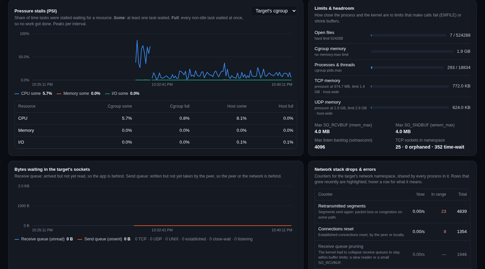</td>
    <td width="50%">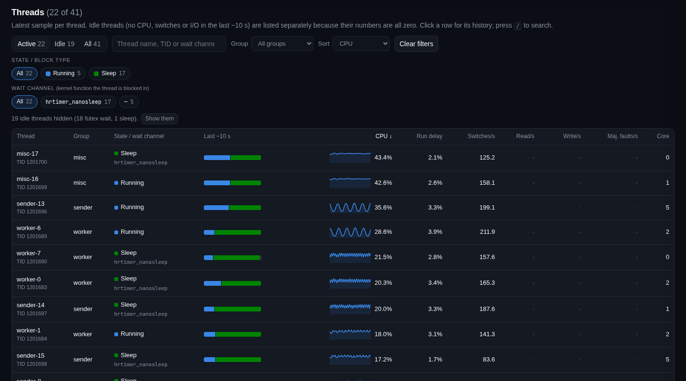</td>
  </tr>
</table>

## Time travel

<p align="center">
  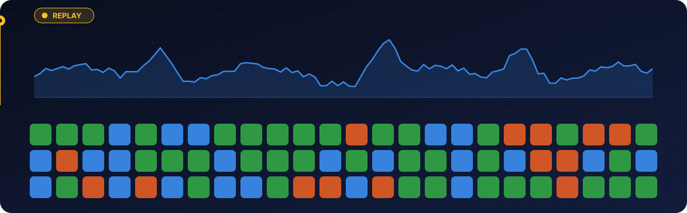
</p>

Turn on `replay_interval_s`, then use **Inspect a moment**. See the
[recording notes](collector/README.md#historical-process-inspection).

## Performance

<p align="center">
  
</p>

Source and limits: [docs/collector-comparison.md](docs/collector-comparison.md).

## Loss and reordering

<p align="center">
  
</p>

## Deploy by copying

<p align="center">
  
</p>

Alerting is a separate module that is not wired up yet
([details](#alerting)). More metrics:
[coverage](docs/linux-monitoring.md), [resource monitoring](docs/resource-monitoring.md),
[TODO](TODO.md). Also see the [architecture diagrams](docs/architecture.md).

# Reference

## Requirements and build

See the [build guidelines](docs/build-guidelines.md) for AlmaLinux package commands,
compiler setup, static releases, required checks, and known deployment limits.

<details>
<summary>Read more</summary>

Linux, GCC/libstdc++ 13+ (C++23: `std::expected`, `std::format`, `std::byteswap`),
GNU Make, Bash, coreutils, diffutils (`cmp`), sed, the compiler's static C/C++
runtime libraries, and libsqlite3 development files for the collector.
Static release verification also needs binutils (`readelf`).
Python 3.11+ is needed only for tests, the optional
sampler control scripts and alerting; it needs no third-party packages.
Node.js is required for the dashboard tests in `make check`.
The basic startup script also uses getconf.
Binary-only deployments without `scripts/sampler_control.py` serve monitoring
without Python; the dashboard hides target control there.
The monitoring binaries need no Node.js.

```sh
make          # sampler, collector and read-only socket report helper
make check    # C++ and Python tests
make format   # format C++ code (2 spaces, Allman braces)
make format-check # verify C++ formatting
```

The sampler links fully statically by default. The collector and socket report
helper embed libstdc++ and libgcc, leaving libc and SQLite as shared libraries.
Builds do not download anything. To build all three programs fully statically:

```sh
make release                       # requires the system's static SQLite library
make check STATIC=1                 # test those same release binaries
```

If your distribution does not ship `libsqlite3.a`, provide `sqlite3.c` and
`sqlite3.h` from the [SQLite amalgamation](https://www.sqlite.org/amalgamation.html)
in the same directory:

```sh
make release SQLITE_SOURCE=/path/to/sqlite3.c
make check STATIC=1 SQLITE_SOURCE=/path/to/sqlite3.c
```

This compiles SQLite directly into the collector and report helper, with dynamic
extension loading disabled. A C compiler is needed for that option. `release`
uses readelf to reject a dynamic loader or shared-library dependencies and fails
if static libraries are missing. Use numeric `udp_host` and `http_host` addresses
in static releases; glibc hostname resolution can require runtime NSS modules.
The optional eBPF source remains a separate build (`make socket-sampler`) and
needs libbpf; it is not included in `release`.

Link options are tracked, so changing between normal and release builds rebuilds
the binaries. `SAMPLER_LDFLAGS` and `RUNTIME_LDFLAGS` can override the defaults
for development toolchains (for example, `make SAMPLER_LDFLAGS= RUNTIME_LDFLAGS=`).

### Deployment dependencies

Goal: deploying Triangulator means copying binaries, with nothing to install.

- **Sampler: zero dependencies.** It runs on production hosts, so it must be
  a fully static binary that needs only the Linux kernel: no shared libraries,
  no interpreter and no packages. Never add a library it would need at run
  time.
- **Collector, dashboard and helpers: as few as possible.** They may run on a
  separate host, so a dependency is tolerated there when it is truly needed,
  but prefer compiling a dependency in (for example SQLite's single-file
  source) over requiring a package. The dashboard is built into the collector
  binary and loads nothing from the network. Optional local dashboard target
  control reuses the Python development script; deployed binaries without that
  script continue to serve monitoring without Python.
- **Build-time only** dependencies (compiler, kernel headers, Python for tests)
  are fine; they never reach the deployed host. Optional Python helpers need
  Python wherever they run.

`make release` produces binaries with no shared-library dependencies. Copy the
collector and socket report helper together so the dashboard can find the helper
next to the collector. The sampler can be deployed on its own, with its config.
Static linking does not remove CPU architecture or Linux kernel requirements.
Remaining work is tracked in [TODO.md](TODO.md#deployment-dependencies).

</details>

## Configuration

<details>
<summary>Read more</summary>

- **Sampler** (`config/sampler.toml`): flat `key = value` with quoted strings,
  booleans and `#` comments. Unknown or duplicate keys and malformed values are
  rejected. The collector address must be a numeric IPv4 or `[IPv6]:port` (no DNS).
  `rate_hz` accepts 0.2–10. `resource_interval_s` (default 5, 0 turns it off,
  at most 60) sets how often resource samples are sent; they are never more
  frequent than thread ticks. `SIGHUP` reloads the file; an invalid file leaves the old
  settings active, and a successful reload starts a new session. Validate with
  `build/triangulator-sampler --check-config config/sampler.toml`.
- **Collector** (`config/collector.toml`): full TOML, read at startup, so restart
  after changes. Validate with
  `build/triangulator-collector config/collector.toml --check-config`. The
  `[alerts]` settings and `deadman_url` are for the alerting module; the collector
  ignores them with a warning, apart from `[alerts] window_s`, the rollup window.
  - `clock_ticks` must equal `getconf CLK_TCK` **on the target host**; the wire
    format does not carry it.

</details>

## Dashboard

<details>
<summary>Read more</summary>

The page opens on a **process overview**, built in the browser from `/api/live`
(nothing extra is sampled or stored):

- **Process load**: 1-, 5- and 15-minute load averages for the target alone,
  computed like `/proc/loadavg`. Load is CPU in use plus demand waiting for a
  CPU (run delay) plus threads in uninterruptible kernel wait. The chart splits
  load into those parts.
- **Assessment**: rules of thumb that point at likely problems: a thread
  saturating a core, CPU waiting, kernel (D) stalls, major page faults, stopped
  threads, thread churn, sampler silence and packet loss.
- **Shape of the process**: active versus idle threads, context switches, I/O,
  thread states over time, CPU by thread family, the busiest wait channels,
  and CPU by the core each thread last ran on.
- **Thread map**: one tile per thread, colored by its current state and
  labelled with its CPU % of one core. Idle threads are faded and blank. The
  Now / 1 min / 5 min / 15 min switch shows CPU over the last ~10 s or the
  average over that window; over a window, a tile is faded only if the thread
  was idle for all of it.

Below it, **Pressure, limits & sockets** shows the latest resource sample and
its stored history (15 minutes to 24 hours): pressure stall shares for CPU,
memory and I/O; open descriptors against the limit; the target's queued socket
bytes; namespace drop and error counters; and the target's fullest sockets,
each explained ("the app is not reading fast enough", "the peer is not
reading"). Its findings join the assessment. See
[docs/resource-monitoring.md](docs/resource-monitoring.md) for how to read it.
Use **Inspect a moment** to select a local date and time and freeze the whole
process view at the latest recording at or before that time. **Previous** and
**Next** step through recordings, including older sampler sessions; **Live**
returns to the current process. The recorded view includes all threads, their
states, wait channels, core placement, CPU, run delay, switches, I/O and health.
Click a thread to open its summary history ending at the recorded time.

Recording is off by default. Set `replay_interval_s` in the collector config
(0.5–60 seconds; `0`, the default, disables it) to save complete views,
independently of `store_raw`. They go to `data_dir/replay/` and use the
existing `retention_days` setting.
Older rollups remain readable but cannot reconstruct a complete process view.
State means the latest sampled observation; rates still cover the preceding
~10 seconds. The selected recording's timestamp and any recording gap are
shown explicitly. Live trend charts, load averages and socket totals are hidden
or unavailable during inspection; thread rollup charts remain available.
Complete snapshots use substantially more disk space than rollups; see the
[recording and storage notes](collector/README.md#historical-process-inspection).

The browser tab keeps these trends for up to 15 minutes, and they survive a
reload of that tab. The thread table shows active threads by default. Idle
threads (no CPU, context switches or I/O in the last ~10 s) are listed apart,
with how long each has been idle, instead of a row of zeros. Click a thread for
a drawer with its live CPU and stored history (CPU, run delay, state mix,
I/O). A light/dark switch is in the top bar.

The page also has alert sections and alert settings. It hides them because the
collector's `/api/live` has no alert fields.

The HTTP listener defaults to loopback. Neither UDP nor HTTP is authenticated, so
use an SSH tunnel or an authenticating reverse proxy for remote access.

The monitoring API is read-only: `/api/live` and
`/api/history?session=SESSION&tid=TID&start=UNIX_SECONDS&end=UNIX_SECONDS`
(at most 2,000 rollups; narrow the interval if `truncated` is true).
Local target control adds `GET /api/target` and `POST /api/target` with JSON
`{"target":"NAME_OR_PID"}` and the `X-Triangulator: 1` header. Other non-`GET`
requests get 501.
`GET /api/resources?start=UNIX_SECONDS&end=UNIX_SECONDS` returns stored
resource samples in at most about 1,000 buckets (default the last 15 minutes).
`/api/replay` returns recording bounds; `/api/replay?at=UNIX_SECONDS` returns
those bounds and the latest recorded process view at or before that timestamp.
Add `direction=previous` or `direction=next` to step strictly before or after it.
A missing recording returns `snapshot: null`; unreadable day files are skipped.

</details>

## Production setup

<details>
<summary>Read more</summary>

The units in `deploy/` are templates with a placeholder target user and collector
IP; edit them first. Install the sampler, collector and `triangulator-socket-report`
binaries in `/usr/local/bin`
and configuration in `/etc/triangulator`. `triangulator-collector.service` runs
the collector. Keep sampler code
and configuration root-owned and not writable by the target user. The collector unit
creates `/var/lib/triangulator`.

```sh
triangulator-collector /etc/triangulator/collector.toml
./build/triangulator-sampler /etc/triangulator/sampler.toml   # as the target user
```

The sampler unit runs at niceness 19 with a 5% CPU quota, a 32 MiB memory limit,
no capabilities and an outbound IP allowlist. Tune the quota after measuring your
real thread count and rate; overruns skip deadlines. The sampler opens no listening
socket, sends no signals to the target and writes no files. Messages go to stderr
(journald), with a one-minute warning rate limit.

Checklist before going live (design section 12):

- Run the sampler as the target user. It needs no privileges: `stat`, `schedstat`,
  `io` and `wchan` are readable by the same user under any Yama `ptrace_scope`.
  It warns if every sleeping thread's wait channel is hidden. Resource samples
  also need the target's descriptor links (same user, dumpable process) and the
  target's network namespace to list its sockets; the dashboard says when either
  is missing.
- Check scheduler statistics under load. If they are missing or all zero, set
  `status_fallback = true` in the sampler config. Zeros alone cannot tell an idle
  process from disabled accounting, so this is your call. Run-delay percentage is
  unavailable in fallback mode.
- Check thread-name prefixes fit Linux's 15-byte limit and the wait-channel names
  your kernel reports (`cat /proc/PID/task/*/wchan`). Unknown names show as `other`.
- Restrict UDP by firewall or WireGuard and route it on the management network.
  Set `sampler_ip`; otherwise the collector pins the first sender it sees.
- Check the disk budget. Nothing alerts yet (see [Alerting](#alerting)), not
  even if the collector stops, so watch the collector and sampler units by other
  means.

</details>

## How it behaves

<details>
<summary>Read more</summary>

- **Wire format:** 48-byte header and 112-byte records (version 2), little-endian,
  at most 10 threads per datagram. A tick holds at most 2,550 threads; the rest are
  dropped with a warning.
- **Loss and reordering:** chunks are deduplicated and reordered for up to two
  sample intervals (max two seconds). Partial ticks are still used, and a missing
  chunk never implies a thread exit. Threads unseen for `max(10 s, 3 intervals)`
  expire. Packet loss is estimated over the last minute.
- **Time:** CPU and scheduler deltas use the sampler's monotonic clock. Counter
  regressions, new sessions and counter-mode changes reset baselines. History needs
  synchronized wall clocks; offsets over one day fall back to arrival time.
- **File descriptors:** the sampler raises its soft open-file limit to the hard
  limit and keeps four `/proc` files open per thread while the budget allows (32
  are reserved); extra threads reopen their files each tick. Running out of
  descriptors skips a tick rather than reporting the target absent.
- **Resource samples:** a summary datagram (version 1, `TRES`) and up to four
  datagrams of socket rows per sample, sharing the thread session. Parts are
  reassembled for up to two seconds; rates use the previous sample of the same
  session and process. Values the sampler could not read stay unavailable,
  never zero. One `resource_sample` row per sample is stored.
- **Storage:** live samples expire after ten minutes and are capped by
  `max_live_samples` (default one million, at most ten million; the collector
  reserves about 280 bytes of address space per sample at startup). History
  is one SQLite file per UTC day (WAL mode) with per-thread rollups, committed
  every half second.
  `store_raw = true` also saves decoded records. Retention deletes whole day files,
  keeping today and the previous `retention_days - 1`. Old day files gain new
  columns when opened.

</details>

## Collector

<details>
<summary>Read more</summary>

`collector/` is the core collector, written in C++ (`scripts/start.sh`,
`deploy/triangulator-collector.service`):
`build/triangulator-collector config/local/collector.toml`.
[collector/README.md](collector/README.md) lists what it does.

**Rule:** latency- and performance-critical code (receiving datagrams, building
per-thread state and rollups, storage, the dashboard API) belongs in C++ or Rust.
Alerting, notifications, reports and richer dashboard data are separate programs
that read the SQLite files or the HTTP API. They must stay off the UDP stream and
out of the collector's main loop. A separate program that needs per-sample data
at high rates must itself be written in C++ or Rust.

The collector replaced an earlier Python collector, which was removed after the
C++ one was shown to store identical rollups for several times less CPU and
memory: see [docs/collector-comparison.md](docs/collector-comparison.md).

</details>

## Alerting

<details>
<summary>Read more</summary>

Nothing sends alerts at the moment. The collector has no alert rules, no dashboard
alert settings and no webhook, dead-man or email delivery. Alerting will be a
separate module that reads the rollups from SQLite or the HTTP API.

`alerting/` holds the Python collector's alerting code, kept as the start of that
module: alert settings and their validation, the alert state machine (open,
remind, resolve), the alert event log and webhook/email delivery. It is not
connected to the collector and does not run. [alerting/README.md](alerting/README.md)
describes what is there and what is missing, including each rule's condition.

</details>

## Socket I/O and messages processed

<details>
<summary>Read more</summary>

The C++ dashboard includes received/sent socket bytes, monitoring-period totals
and averages, recent minimum/maximum rates, and a breakdown by thread and socket
kind. Build the optional source with `make socket-sampler`; it requires existing
BPF tracing privileges and a compatible kernel. Completion counts require an
explicit application marker called once after successful processing. Setup and
measurement limits are in [the socket design guide](docs/socket-ingress-design.md).
Reporting runs in the separate `triangulator-socket-report` executable installed
next to the collector; `/api/socket-io?pid=PID` exposes the report.

With the collector running, start observation on the target host:

```sh
scripts/set-target.sh ghostty
scripts/watch-sockets.sh --sudo ghostty
# Or use a PID, optionally with an application completion marker:
scripts/watch-sockets.sh --sudo --marker /absolute/path/to/application TriangulatorMessageProcessed 1234
```

The wrapper builds the optional source (clang with BPF support and libbpf
development files are required), resolves the target, and runs in the foreground.
`--sudo` elevates only the observer; omit it when tracing privileges are already
available. Ctrl+C stops it. Logs are appended to `.run/socket-sampler.log`.
The target must be a process ID (not a thread ID) or a unique process name. The
collector endpoint defaults to the running sampler's, so both reach the same
dashboard, or to `config/local/sampler.toml` when the sampler isn't running;
override it with `--collector IP:PORT` for a remote collector. If the running
sampler or its config cannot be inspected, the wrapper requires an explicit
`--collector` instead of falling back to the local config. The dashboard's
Socket I/O & message processing panel follows the normal sampler's target PID,
so use `scripts/set-target.sh` to select the same PID. Choose Received, Sent, or
Messages processed in that panel.
Message counts remain unavailable without an application completion marker;
socket traffic alone cannot tell when a message has finished processing.
Restart the wrapper when switching targets or when the target process restarts.

</details>

## Layout

<details>
<summary>Read more</summary>

- `sampler/`: C++ sampler (`main.cpp` loop, plus headers for config, `/proc`
  parsing and cache, RAII resources, and the resource probe: `resources.hpp`,
  `resource_parsing.hpp`, `socket_diag.hpp`).
- `common/`: code both programs use: the datagram formats (`wire.hpp` for
  threads, `resource_wire.hpp` for resource samples) and the `FileDescriptor`
  wrapper (`fd.hpp`). It depends only on
  the standard library, so neither program depends on the other's directory.
- `collector/`: C++ core collector, without alerting, and the dashboard page it
  serves (`dashboard.html`).
  [collector/README.md](collector/README.md) lists what it does.
- `alerting/`: Python alerting code kept for the future alerting module; not
  wired up (see [alerting/README.md](alerting/README.md)).
- `socket_sampler/`: optional C++/eBPF socket and completion-marker source.
- `metrics/`: separate read-only C++ reporting program.
- `config/`, `deploy/`: example configuration and systemd units.
- `scripts/`: `start.sh` and `stop.sh`.
- `tests/`: C++ tests (wire format, sampler, collector) and Python tests (alerting, and
  end-to-end runs of the real sampler and collector, including a real `/proc`
  check).

</details>

## License

MIT. See [LICENSE](LICENSE).
