# Collector

Receive sampler data. Build thread summaries. Store history and serve the dashboard.

<p align="center">
  
</p>

## Quick start

1. Run from the repository root:

   ```sh
   scripts/start.sh
   ```

2. Open <http://127.0.0.1:9401>.

The script builds and starts both programs with local configuration files.

## Run separately

Use an existing local configuration:

```sh
make build/triangulator-collector
build/triangulator-collector config/local/collector.toml --check-config
build/triangulator-collector config/local/collector.toml
```

[Configuration example](../config/collector.toml) ·
[Collector reference](../docs/collector-reference.md) ·
[Sampler](../sampler/README.md) ·
[Performance](../docs/collector-comparison.md)

## Dashboard help

Pause over a metric, table cell, or chart point for 1.2 seconds to see its
explanation. Move into the card to read it, or press Escape to close it.
Select an information button for examples, measurement limits, related topics,
and a chart data table where available. Keyboard users can focus the information
button; touch users can tap it. **How to read this page** contains the page guide.

The guide includes **Show help on hover or focus**. This preference is saved in
the browser. Turning it off keeps explicit guide access available.
