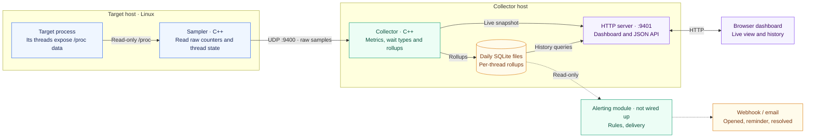
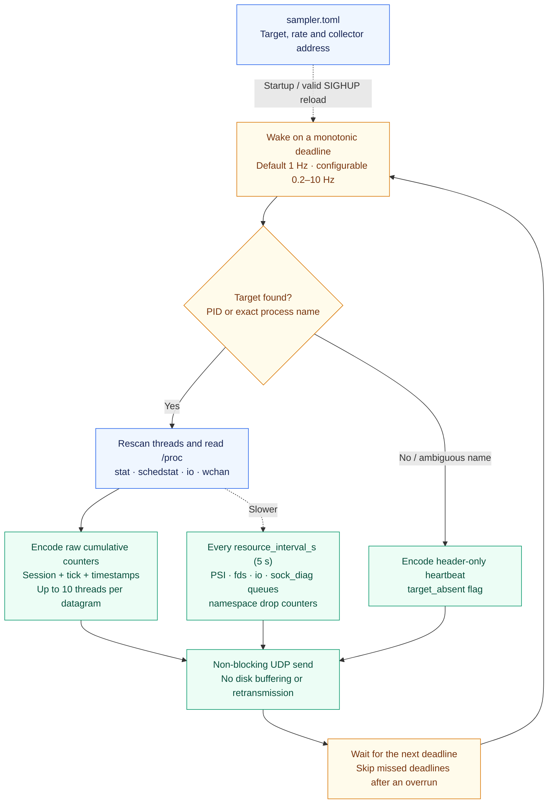
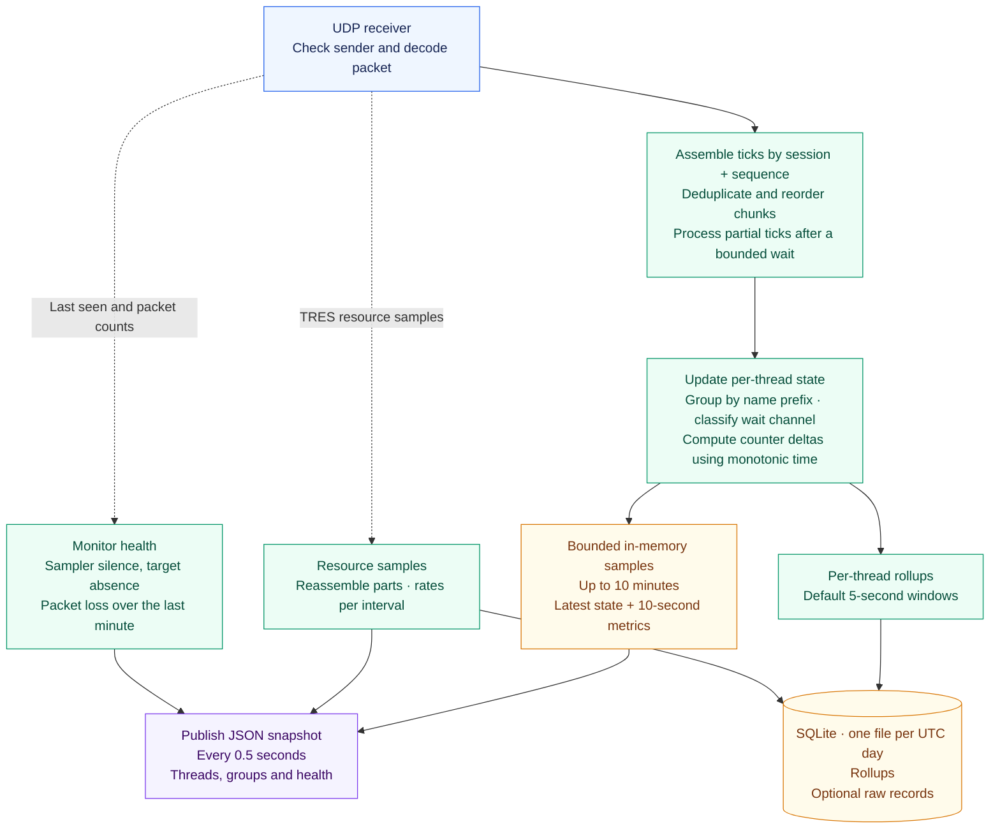
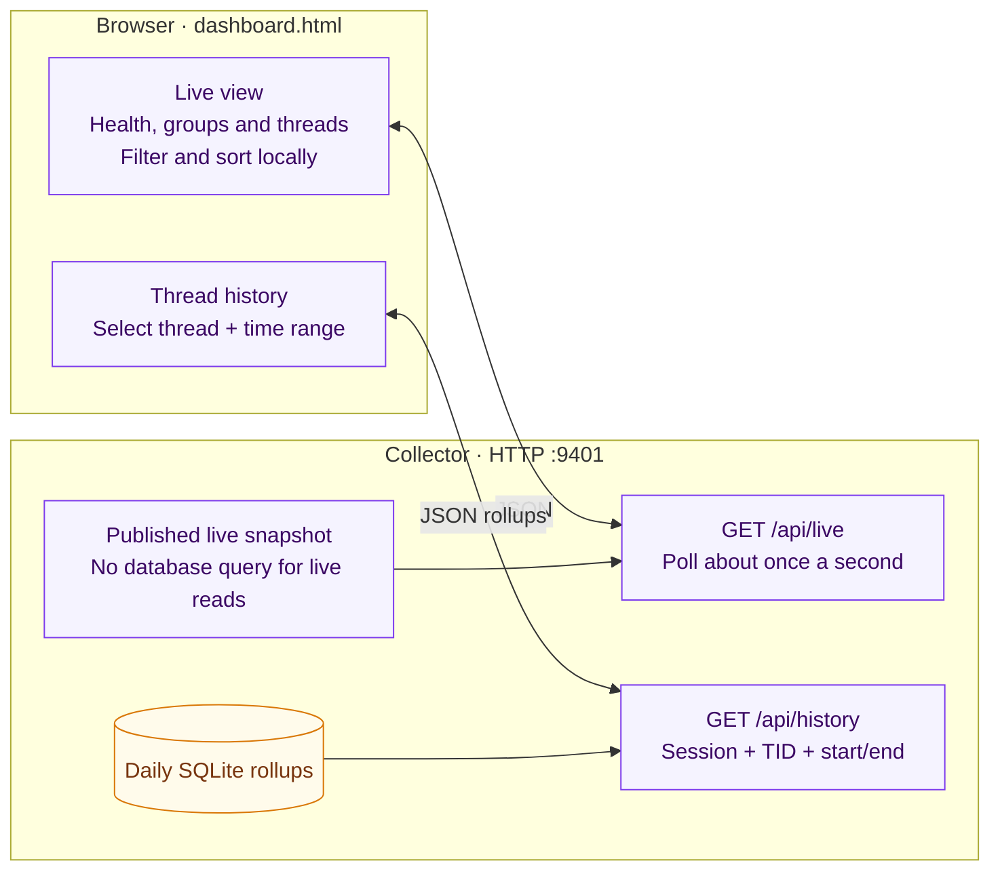

# Architecture at a glance

Triangulator has three parts: a **sampler** reads Linux thread data, a
**collector** turns it into metrics and history, and a **dashboard** displays it
in the browser. Both programs are C++; `scripts/start.sh` starts them. Alerting
will be a separate module (`alerting/`, not wired up yet), shown dashed below.
Ports and timings shown below are defaults.

## End-to-end flow

The two hosts can be the same machine. The sampler needs no application changes
and runs as the target's user. UDP carries samples in one direction; all
interpretation, persistence and dashboard requests happen on the collector host.

## Sampler: one tick at a time

The sampler reports facts, not CPU percentages or alert decisions. A new session
starts on sampler startup, a valid config reload, or a target identity change
(PID + start time). If target lookup fails because of a resource error, the tick
is skipped. A missing target heartbeat means **sampler alive, target absent**;
no packets means **sampler silence**. Optional `status` reads replace scheduler
counters when `status_fallback` is enabled. Every `resource_interval_s` seconds
the sampler also sends a resource sample in its own `TRES` format: pressure
stalls for the host and the target's cgroup, descriptors, storage I/O, the
target's socket queues and buffers (sock_diag) and its network namespace's
counters. See [resource-monitoring.md](resource-monitoring.md).

## Collector: raw samples to useful signals

The main loop owns monitor state. A separate HTTP thread serves snapshots and
history, so dashboard requests never delay receiving datagrams. New sessions or
regressing counters reset baselines. Missing chunks do not imply thread exits.
Socket, futex and poll waits are shown as wait types. The collector evaluates no
alert rules.

## Dashboard: live view and history

The collector serves the page at `/`; the browser receives JSON from the same
HTTP server. History comes from stored rollups (at most 2,000 per request), not
the live sample buffer. The page also contains alert sections and an alert
settings form; it hides them because `/api/live` has no alert fields.

For setup, see the [README](../README.md); for the future alerting module, see
[alerting/README.md](../alerting/README.md). For protocol details, alert rules and
operational constraints, see the [full design](thread-monitor-design.md).
