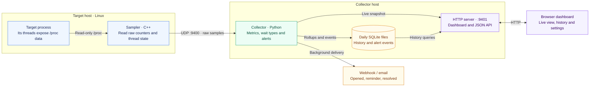
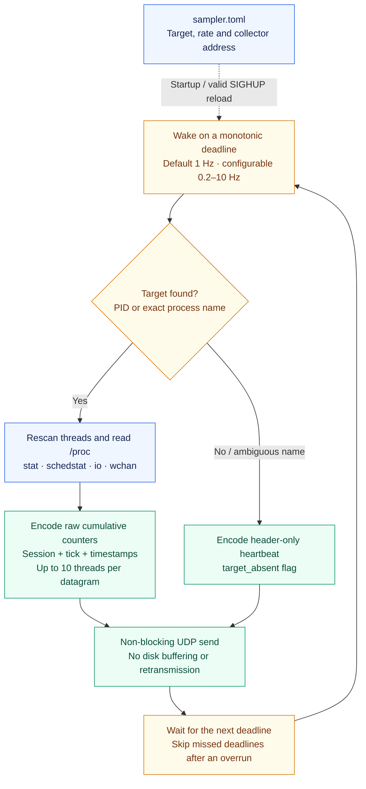
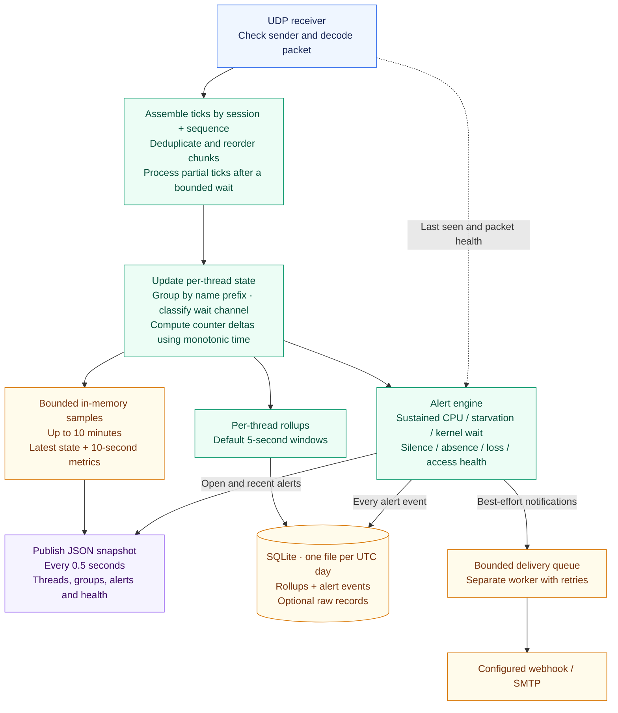
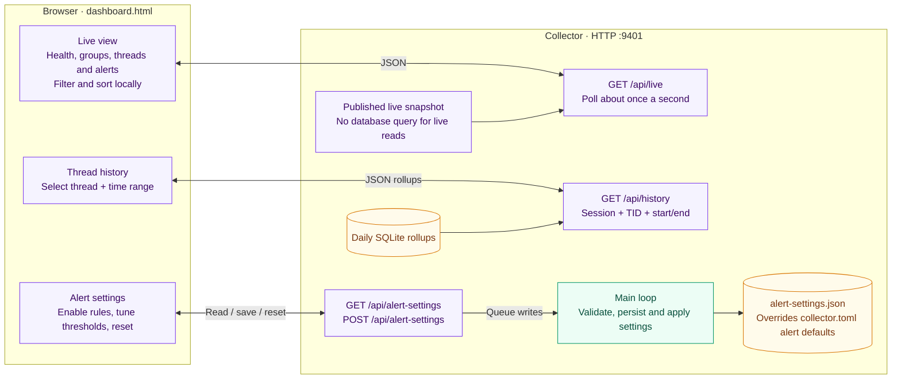

# Architecture at a glance

Triangulator has three parts: a **sampler** reads Linux thread data, a
**collector** turns it into metrics and alerts, and a **dashboard** displays it
in the browser. The diagrams follow the default Python collector started by
`scripts/start.sh`. Ports and timings shown below are defaults.

## End-to-end flow

The two hosts can be the same machine. The sampler needs no application changes
and runs as the target's user. UDP carries samples in one direction; all
interpretation, persistence and dashboard requests happen on the collector host.

## Sampler: one tick at a time

The sampler reports facts, not CPU percentages or alert decisions. A new session
starts on sampler startup, a valid config reload, or a target identity change
(PID + start time). If target lookup fails because of a resource error, the tick
is skipped. A missing target heartbeat means **sampler alive, target absent**;
no packets means **sampler silence**. Optional `status` reads replace scheduler
counters when `status_fallback` is enabled.

## Collector: raw samples to useful signals

The main loop owns monitor state and applies settings changes. A separate HTTP
thread serves snapshots and history; a delivery worker sends notifications so
network retries do not block sampling ingestion. New sessions or regressing
counters reset baselines. Missing chunks do not imply thread exits. Ordinary
socket, futex and poll waits are shown as wait types; they do not trigger alerts.

## Dashboard: live view, history and settings

The collector serves the page at `/`; the browser receives JSON from the same
HTTP server. History comes from stored rollups (at most 2,000 per request), not
the live sample buffer. Settings changes affect the collector's alert engine
immediately and survive restart; sampler settings stay in `sampler.toml`.

For setup, see the [README](../README.md). For protocol details, alert rules and
operational constraints, see the [full design](thread-monitor-design.md).
