# Does the dashboard find real resource bugs?

We wrote a sample program, `buggy-workload`, with twelve deliberate resource
bugs. Each is a mistake that production services really make. We ran every bug
under Triangulator and recorded what the dashboard said. The aim is to learn
which real problems the product finds, which it misses, and where it misleads.

- Program: [`examples/buggy-workload/buggy_workload.cpp`](../examples/buggy-workload/buggy_workload.cpp)
- Run one scenario: `examples/buggy-workload/run-scenario.sh <scenario>`
- Re-take every screenshot: `examples/buggy-workload/capture-screenshots.sh <dir>`
- Screenshots: [`docs/screenshots/buggy-workloads/`](screenshots/buggy-workloads/)

## Result at a glance

| # | Scenario (bug) | Verdict | What the dashboard said |
|---|---|---|---|
| 1 | `cpu-spin`: busy loop and a poll loop that never blocks | Found | Both threads named as "saturating a core" |
| 2 | `oversubscribed`: 4 CPU-bound threads per core | Found | "Threads are waiting for CPU", run delay 392% |
| 3 | `lock-convoy`: slow call made while holding one lock | **Missed** | "Healthy: no problems detected" |
| 4 | `deadlock`: two locks taken in opposite order | **Missed** | No deadlock finding; one misleading CPU finding |
| 5 | `memory-leak`: cache without eviction, mappings never freed | Found, with gaps | Memory section: RSS "grows without a plateau". Summary: "Healthy" |
| 6 | `fault-storm`: buffer mapped and touched per request | Partly | Saw the CPU, not the cause (14.2 M minor faults, shown only as a total) |
| 7 | `thread-leak`: a thread per request that waits forever | **Missed** | 402 threads, no growth finding |
| 8 | `thread-churn`: a new thread for every tiny task | **Missed** | "+2 / −2" per minute; the real rate is about 200 per second |
| 9 | `fd-leak`: files never closed, then a tight retry loop | Found | "100% of file descriptors in use", plus the spinning thread |
| 10 | `close-wait`: accepted sockets never closed | Found | Four related findings, including CLOSE-WAIT |
| 11 | `slow-consumer`: readers slower than TCP and UDP senders | Found | UDP drops, full receive buffer, zero window |
| 12 | `sync-storm`: `fsync` after every record | Found | "I/O is stalling all work", D-state threads named |
| 13 | CPU quota and memory cap (cgroup limits) | Found, with a gap | CPU throttling named. OOM kill reported only as "target absent" |

The product finds most problems that leave a kernel-visible trace: saturated
CPU, descriptors, socket queues, storage stalls, cgroup limits. It misses
problems that only show as threads that do not run (locks, deadlocks), as
counts that grow slowly (threads), or as events faster than the sample interval
(thread churn).

## How we ran it

- One sampler and one collector per scenario, on their own ports, started by
  `run-scenario.sh`. Sampling at 2 Hz, resource samples every 1 s, memory map
  every 5 s, recording every 1 s. The monitored process is `buggy-workload`.
- Each scenario ran until its symptoms had developed (20 to 50 seconds), then
  headless Chromium saved a full-page screenshot. The crops here show the
  relevant part.
- Threads are named (`worker-`, `io-`, `sender-`, `misc-`) so the dashboard's
  thread families and findings can be matched to the bug that caused them.
- Unbounded growth stops at a cap (1 GiB of cache, 6,000 mappings, 400
  threads) so a forgotten run cannot hurt the host.
- Each scenario ran once, on one 6-core host with 15 GB of RAM.

**Baseline.** A healthy idle process gives the comparison point: "Healthy", no
findings.

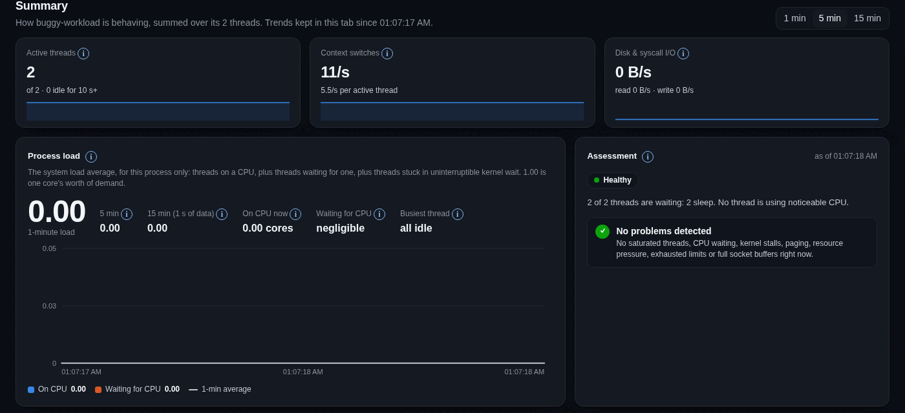

## Bugs the dashboard found

### 1. CPU spin

`worker-spin` computes in a loop; `worker-poll` polls an empty flag without
blocking. Both use 99.8% of a core. The assessment names both threads and warns
that work queued behind them waits. Nothing extra is needed to read it.

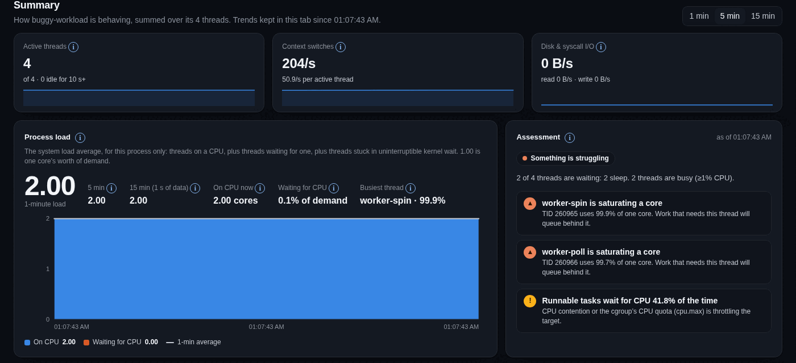

### 2. Oversubscription

24 CPU-bound threads on 6 cores. The load chart splits "on CPU" (4.87 cores)
from "waiting for CPU" (19.11), and the assessment says run delay is 392% of
CPU time and the host may be oversubscribed. This is the clearest example of
why run delay is worth sampling.

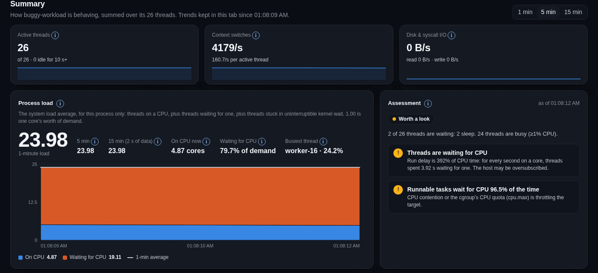

### 9. Descriptor leak and tight retry loop

`io-leak` opens `/dev/null` and never closes it. With a limit of 256, the
dashboard shows "100% of file descriptors in use" with the EMFILE
explanation. The same screen shows the second-order symptom: after the limit,
`open()` fails and the error path retries with no backoff, so `io-leak` now
saturates a core. Two findings, one root cause, both correct.

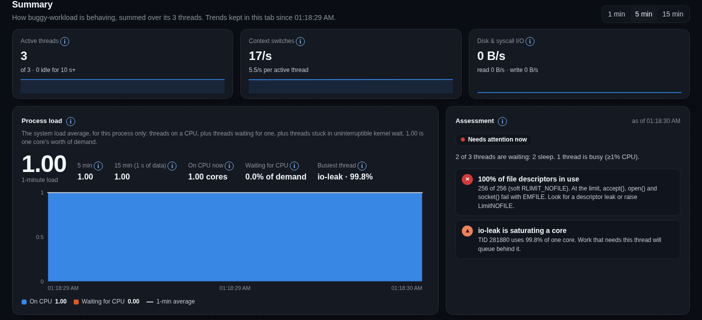

### 10. Sockets never closed (CLOSE-WAIT)

The server accepts connections, never reads or closes them. The dashboard shows
the whole cascade: descriptors at the limit, the accept backlog 125% full (5
connections waiting with a backlog of 4), a socket with a zero
window, and 123 connections in CLOSE-WAIT with the hint "a missing close() on
an error path". This is the best result in the run.

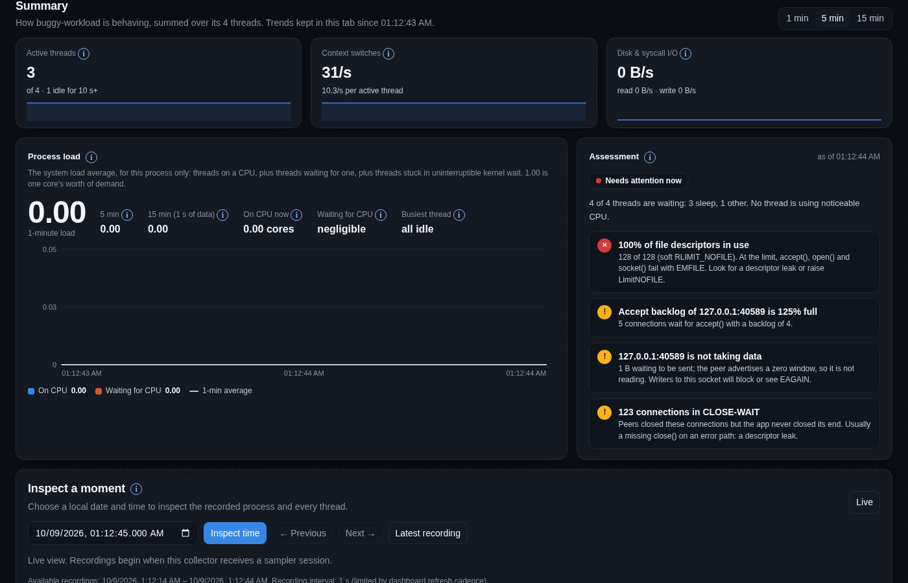

### 11. Slow consumers (TCP and UDP)

A reader takes 512 bytes every 200 ms from a sender that never stops. The
dashboard reports 868 UDP datagrams dropped because the receive buffer is full
(with the fix: a slow reader or a small `SO_RCVBUF`), the TCP receive buffer
98.8% full, and the peer advertising a zero window. It tells the owner of the
reading side where to look.

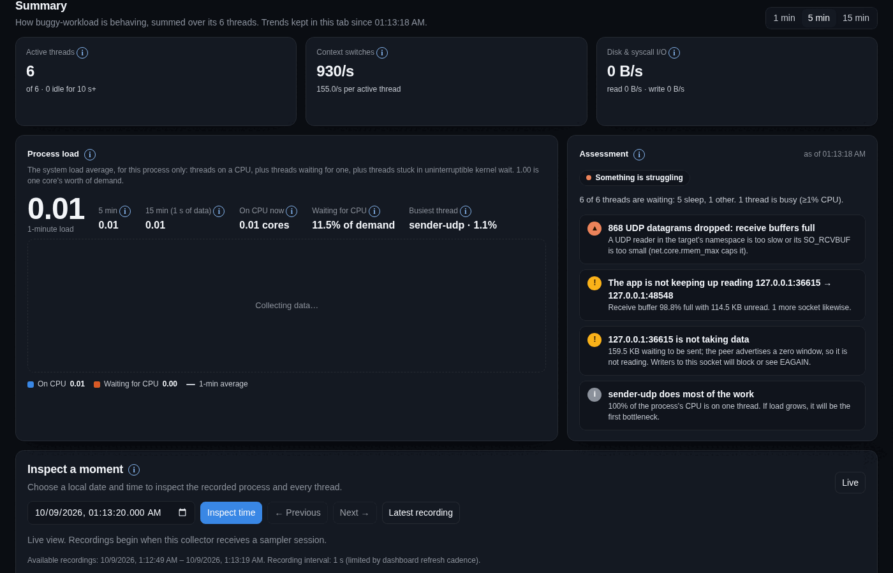

### 12. Storage stalls (`fsync` storm)

Four writers `fsync` after every 256 KiB. CPU stays low (0.34 cores) while load
is 4.38: the red area is threads blocked in the kernel. The dashboard reports
"I/O is stalling all work 6.2% of the time", names the four D-state threads,
and shows 306.6 MB/s written.

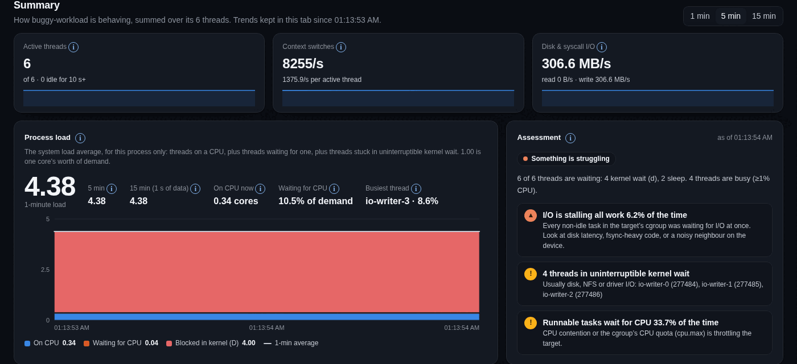

### 13. cgroup limits

Run in a systemd scope with `CPUQuota=30%` and `MemoryMax=400M`.

CPU: the dashboard reports "CPU quota throttled 100% of periods" and says to
raise `cpu.max` or reduce use. Correct and actionable.

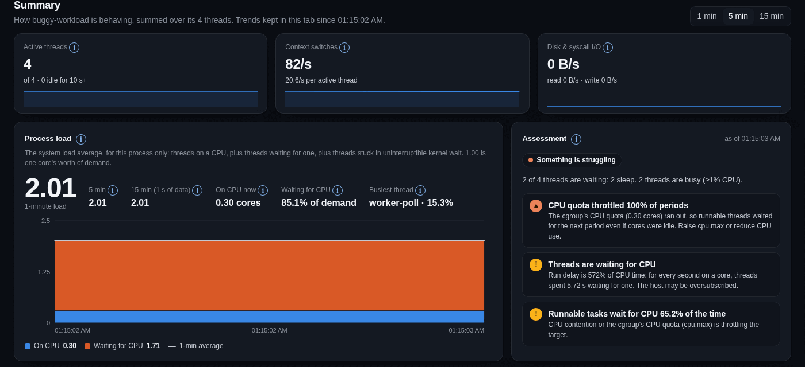

Memory: the leak ran into the cap and the kernel killed the process. See gap F
below.

## Bugs the dashboard found only in part

### 5. Memory leak

The Memory section is right: a WARNING says "Resident memory grows without a
plateau", with RSS up in 50 of 50 samples (+975.8 MB/min), almost all of it
anonymous memory. But the Summary at the top of the page, the first thing a
person reads, says "Healthy: no problems detected" for the same moment.

The second leak (6,000 mappings that are never unmapped, 9,038 mappings at
capture time) has no finding. The count is shown, as "9038 / 1048576", but a
count that is climbing is not called out.

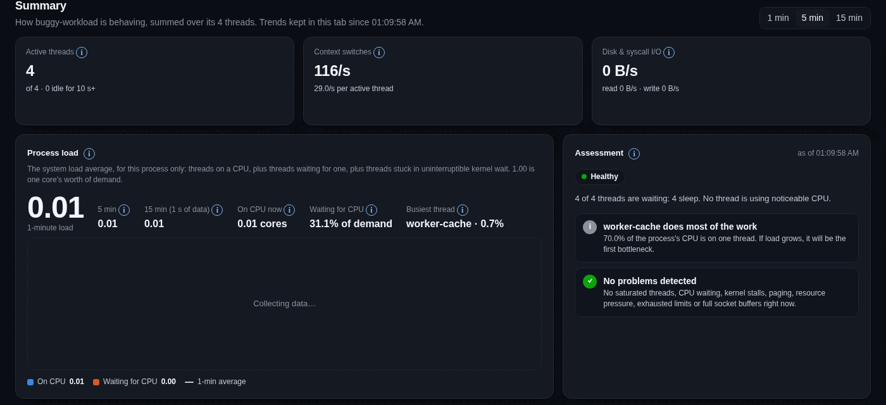
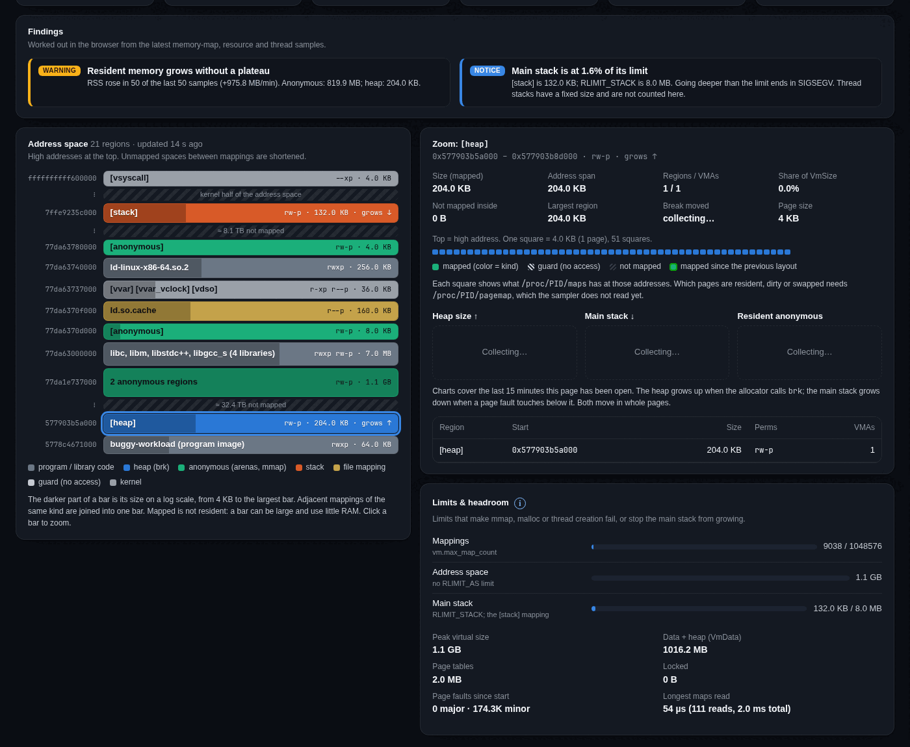

### 6. Page-fault storm

Two threads map, touch and unmap 64 MiB per request. The dashboard flags both
as saturating a core, which is true, but it does not say why. The cause shows
only as a total ("14.2 M minor faults since start") in the memory section.
There is no fault rate, no per-thread fault rate (only major faults per thread),
and no user/system CPU split, which is the quickest way to see time spent in
the kernel.

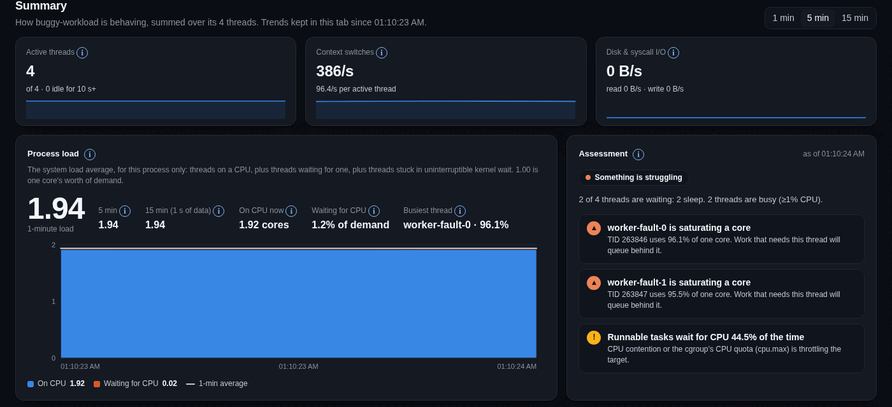

## Bugs the dashboard missed

### 3. Lock convoy

Eight threads share one lock and the holder sleeps 40 ms inside it. Seven
threads wait on a futex, one sleeps, CPU is zero. Throughput is that of one
thread. The dashboard says "Healthy", and its own text explains why: "many idle
futex waiters are normal for thread pools". It cannot tell a pool waiting for
work from a pool waiting for a lock.

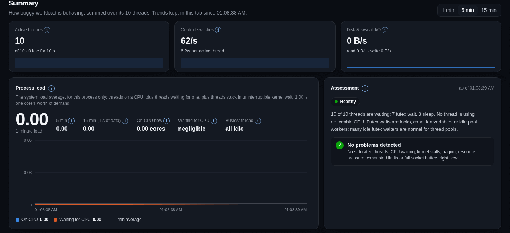

### 4. Deadlock

Two threads each hold one lock and wait for the other, forever. The process is
alive and idle: 5 threads in futex wait, 2 asleep, no CPU. The dashboard shows
"Worth a look", but only because of the unrelated CPU-pressure finding (see
"False alarms"). Nothing says "these threads have been waiting a long time".

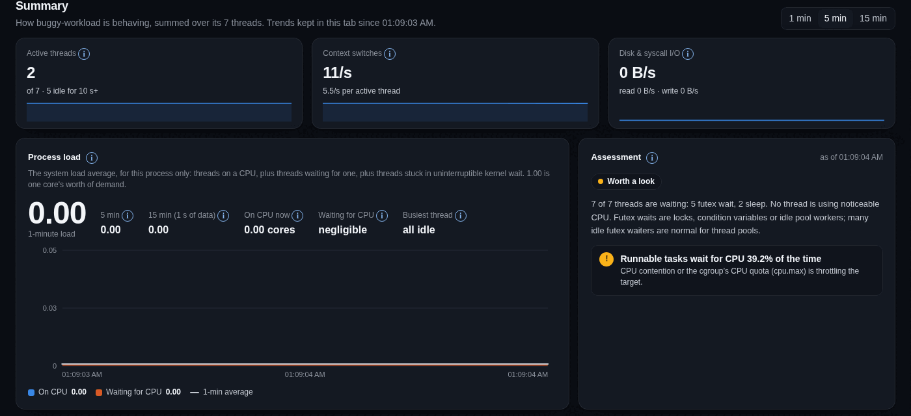

### 7. Thread leak

A thread per request that waits forever: 402 threads after 45 seconds. The
header shows "402 threads" and 400 idle, but there is no finding for steady
growth, and the limit meter for threads shows 607 / 18,834, which is the whole
cgroup, not this process.

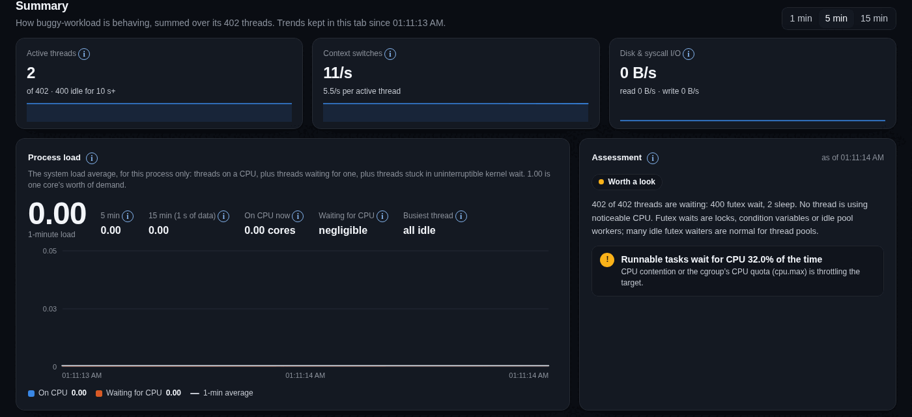
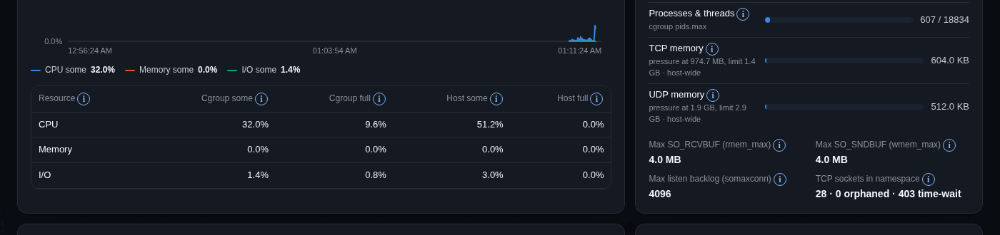

### 8. Thread churn

A new thread for every 5 ms task, about 200 per second. The dashboard shows
"+2 / −2 started / ended, last minute". The sampler reads thread lists at
2 Hz, so threads that live 5 ms are almost never seen. The assessment says
"Healthy".

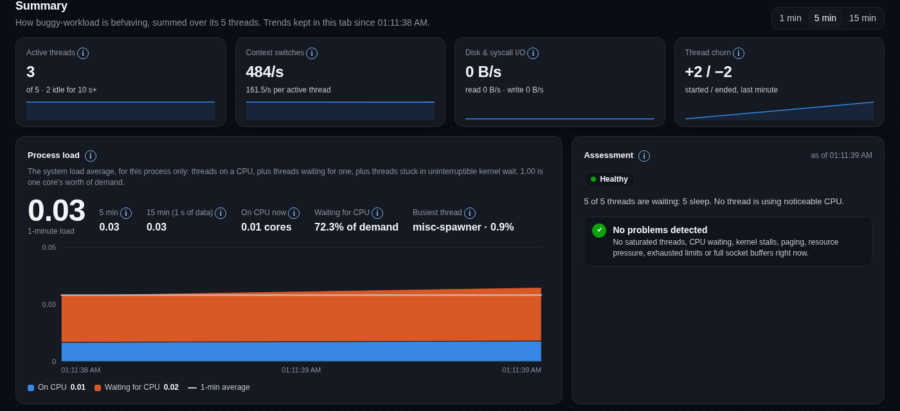

## Gaps and false alarms to fix

Listed from the most to the least important for support work.

**A. Cgroup sharing causes false alarms.** "Runnable tasks wait for CPU 30 to
45% of the time" appeared in five scenarios where this process could not
explain it: three whose threads were idle or blocked (deadlock 39.2%,
thread-leak 32.0%, fd-leak 41.4%) and two with little CPU demand (fault-storm
44.5%, sync-storm 33.7%). The idle baseline had 0%. The sampler uses the target's cgroup pressure, but on this host that
cgroup is `t3code.service`, holding 607 tasks, so the stall time belongs to
neighbours. The dashboard already reads the cgroup's task count; it could
compare it with the target's thread count and say "pressure shared with N other
tasks". Without that, a support engineer chases the wrong process. We did not
separately measure the neighbours, so treat the cause as likely, not proven.

**B. Blocked-forever threads are invisible.** Deadlocks and lock convoys look
like an idle process. Useful signals already in the sample: how long each
thread has stayed in the same wait channel and state, and whether threads in
`futex_wait` have made no switches for minutes while the process receives
traffic. Even a plain "N threads have waited on the same futex for more than
60 s" would have caught the deadlock.

**C. Growth findings are not in the Summary.** The memory leak finding exists
but the Summary says "Healthy". Findings from the Memory and Pressure sections
should join the Summary assessment, as pressure and limits already do.

**D. Slow growth of threads and mappings is not trended.** Thread count,
mapping count and descriptor count rise steadily in the leaks above. Only
descriptors have a finding, and only at the limit. A "grows without a
plateau" rule like the one for RSS would cover threads and mappings.

**E. Thread churn is undercounted.** At 2 Hz, short-lived threads are missed.
Thread ID numbers move forward as threads are created, so the change in the
highest TID since the previous sample estimates creations without seeing the
threads. This needs a decision before implementing.

**F. Cause of death is not reported.** After the kernel killed the leaking
process, the dashboard said "Target process is absent: check it is running"
and still listed "Cgroup memory is 97.2% of its limit". It did not say the
process was OOM-killed. Since the cgroup's `memory.events` records `oom_kill`,
a killed target in a memory-capped cgroup could say so.

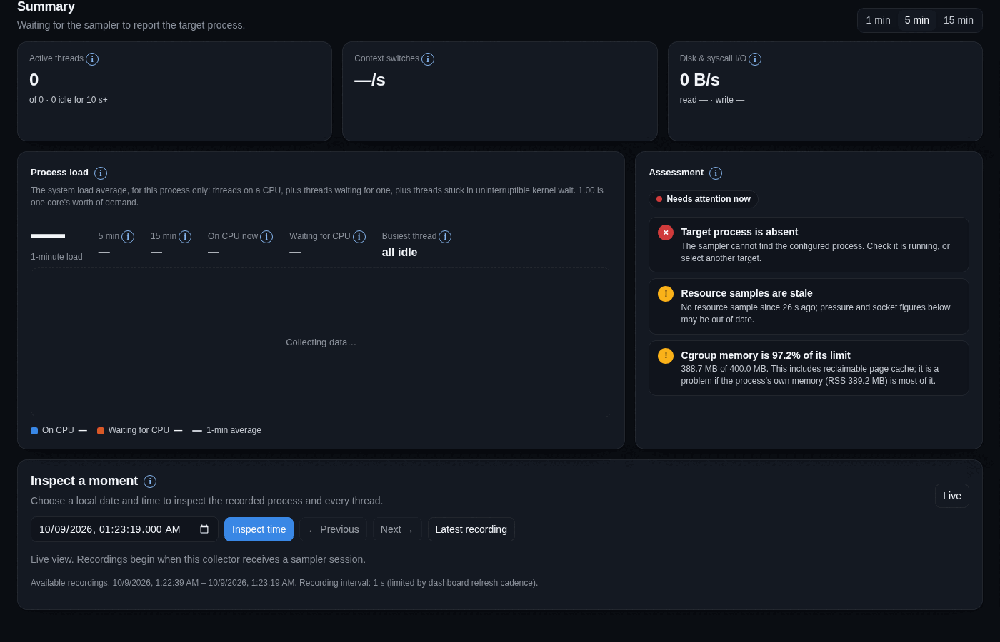

**G. Page-fault rate and kernel/user CPU split are missing.** See bug 6.

**H. Reading the map file costs more as mappings grow.** With 9,038 mappings
the longest `/proc/PID/maps` read took 4.2 ms (6.9 ms total across 123 reads);
it was 27 µs with a normal process. That is acceptable at a 30 s interval, but
the cost scales with the leak the feature is meant to find.

## What we did not test

- Bugs in the monitored program that need application knowledge, such as wrong
  results or slow business logic. The product has no such inputs.
- Page cache and swap thrashing, major faults, NUMA and network path problems.
- Whether descriptor and memory findings fire early, while growth is under way.
  We captured them at or near the limit.
- Replay ("Inspect a moment") for these runs. Recordings were written, but we
  did not review them.
- Chart history. The screenshots show "Collecting data…" in some charts because
  the dashboard keeps live trends only while the tab is open and headless
  Chromium had it open for seconds. Stored pressure history comes from the
  collector and is not affected.
