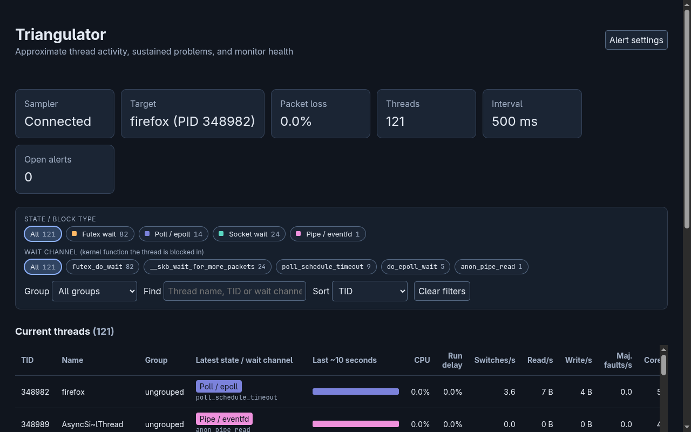
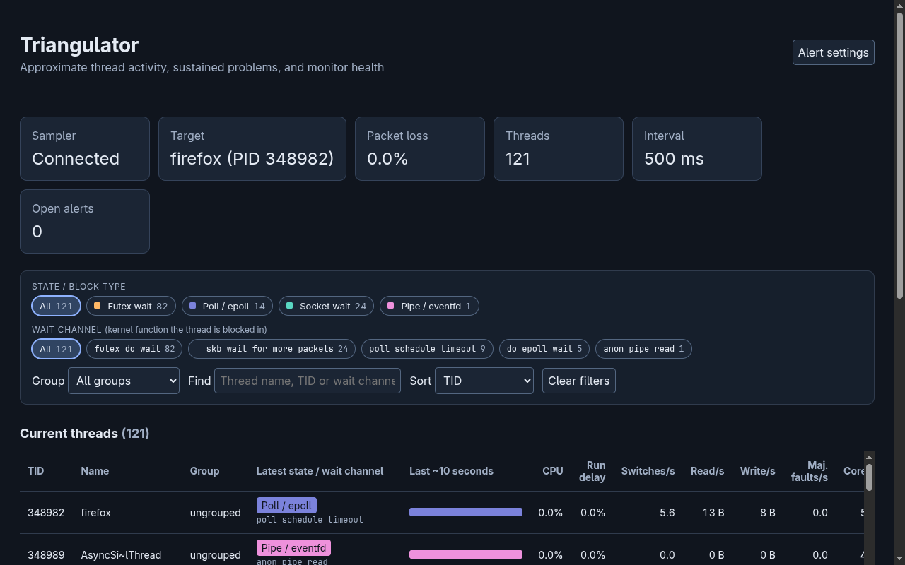
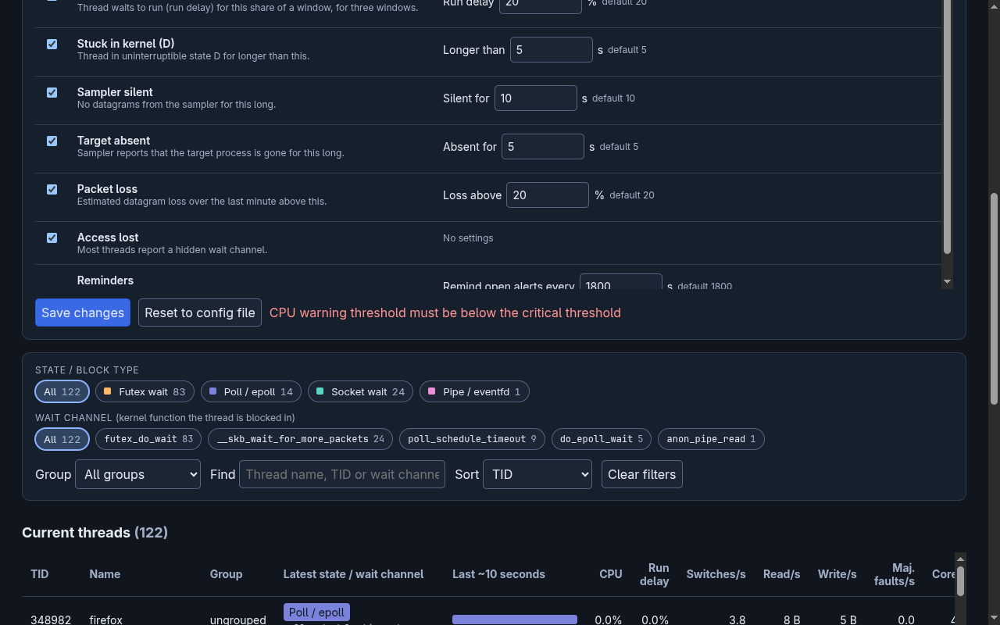
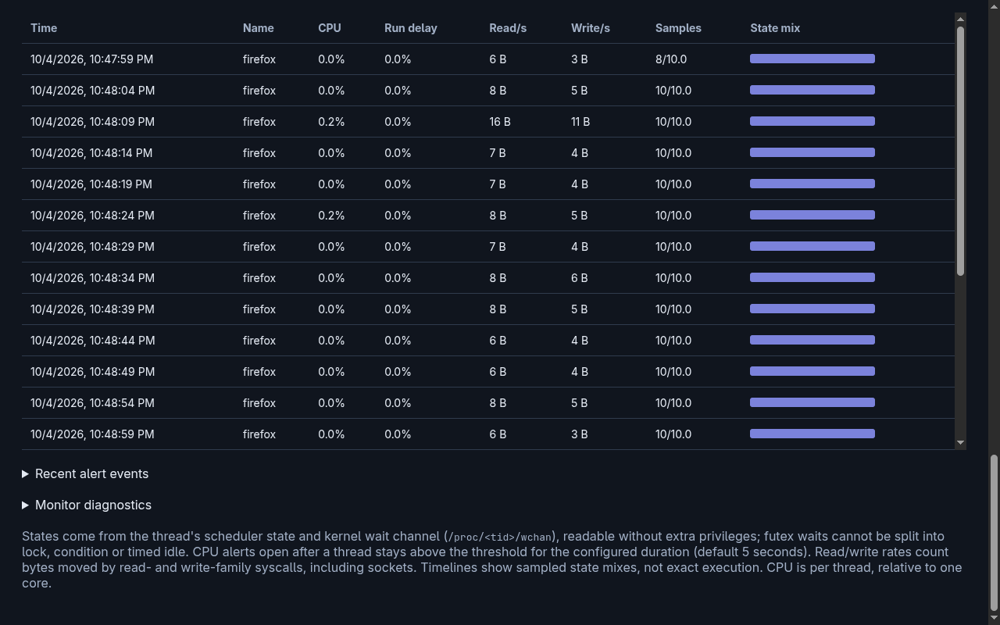
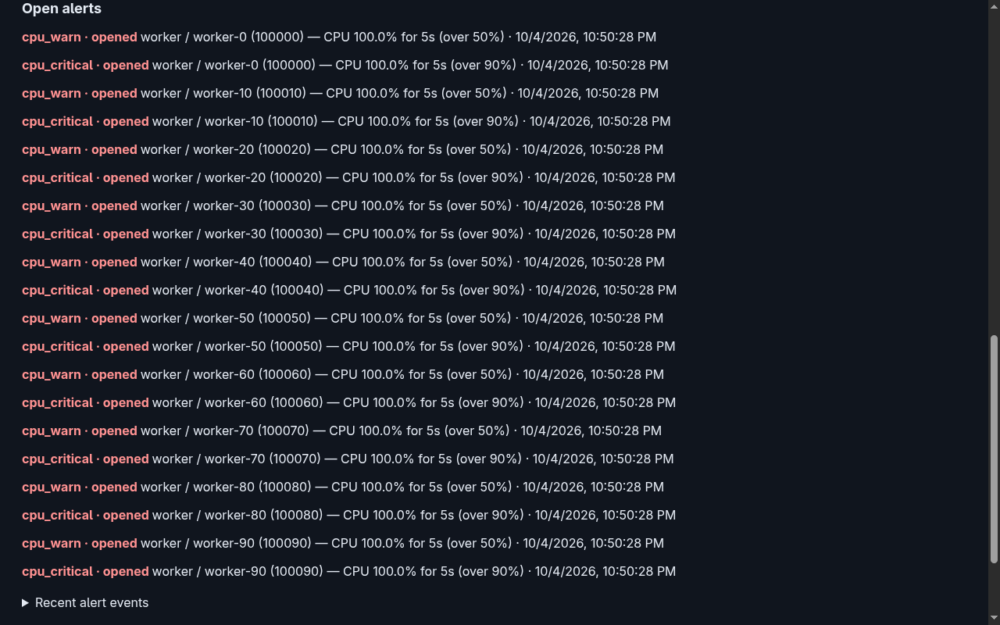
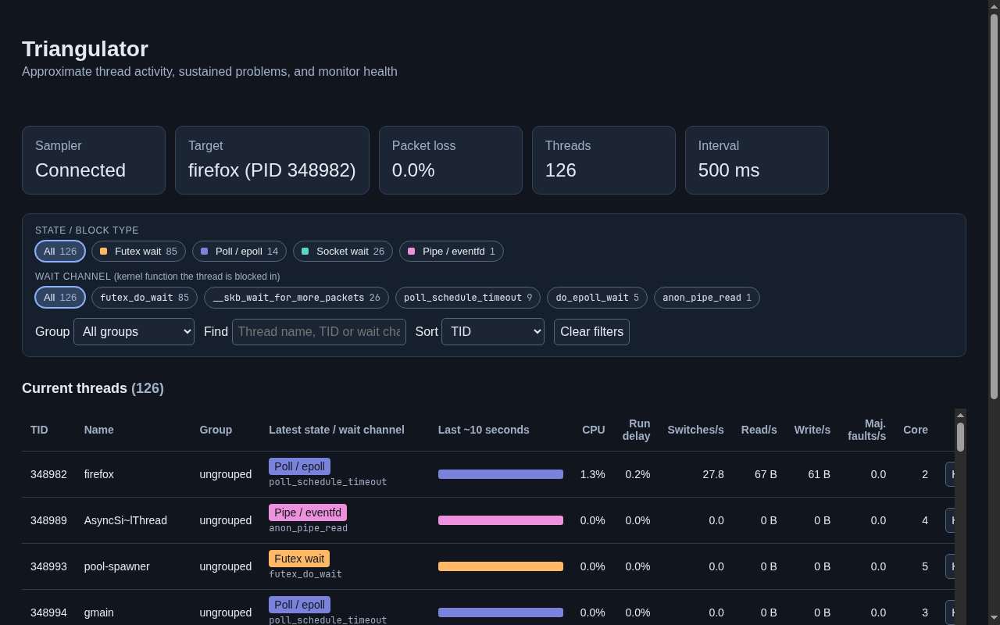

# Python vs C++ collector: test results

The C++ port of the collector (`collector/`) was compared with the Python
collector (`triangulator/`) on correctness and on resource use, run side by side
on the same sampler data. Measured on 2026-10-04.

> **Two stages.** Most measurements below were taken while the C++ collector
> was still a full port, including alert rules and webhook delivery (commit
> `7a1d83b`), so the two did the same work. Alerting was then removed from the
> C++ collector: it now only receives, stores and serves data, and alerting
> becomes a separate module. [After removing alerting](#after-removing-alerting)
> has the measurements of that version. The Python collector still evaluates
> alerts, so those numbers compare different amounts of work.

**Summary:** both collectors produced the same results in every check. The C++
collector used 5–11× less CPU and 2.3–2.8× less memory. Its dashboard API
stayed under 2 ms at the 95th percentile, where Python's reached 22–79 ms under
load. Neither lost packets, even at 2,500 threads × 10 Hz (about 2,500
datagrams a second).

## Correctness

### Automated tests (`make check`, 37 tests, all pass)

Current tests, with alerting removed from the C++ collector:

| Test | What it checks |
|---|---|
| `CollectorIntegrationTests` | Python collector, end to end: real sampler → collector → dashboard, `/api/history`, settings validation (400 on bad values, 403 on cross-site and foreign `Host`), save and reset, webhook delivery of a `target_absent` alert |
| `CppCollectorIntegrationTests` | C++ collector, end to end: real sampler → collector → dashboard and `/api/history`. Also checks that `/api/live` has no alert fields, that `/api/alert-settings` is gone (404, POST 501), that alert keys in the config are accepted with a warning, that a bad `window_s` is rejected, and that nothing is written to `alert_event` |
| `CollectorParityTests` | The same 600 datagrams (12 threads, 300 ticks at 10 Hz, with reordered and repeated chunks) sent to both collectors. Requires identical `thread_rollup` rows: every column, floats to 9 decimal places |
| Other existing tests | Sampler, protocol, engine and config tests |

Before alerting was removed, the C++ collector also passed the Python
collector's full end-to-end test (settings and webhook included). The parity
test also required identical thread alerts (`cpu_warn`, `cpu_critical`,
`starved`, `kernel_wait`), and they were identical.

### Live agreement

During every comparison run, `scripts/compare.py` checked at each refresh that
both collectors reported the same thread ids and the same latest state per
thread. Before alerting was removed, it also compared open alerts.

| Run | Refreshes that matched |
|---|---:|
| Firefox, 1 Hz, 3 min | 35/36 |
| Firefox, 2 Hz, 2 min | 26/26 |
| Firefox, 10 Hz, 3 min | 36/36 |
| Synthetic, 1,000 threads, 10 Hz, 3 min | 36/36 |
| Synthetic, 2,500 threads, 10 Hz, 2 min | 24/24 |

The one mismatch at 1 Hz is a timing artifact, not a disagreement. The two
dashboards are read a few milliseconds apart, and a Firefox thread started or
exited in between. The next refresh matched.

### Dashboard, checked in a browser

Tested against the C++ collector with live Firefox data, while it still had
alerting (commit `7a1d83b`). The Python dashboard
was open at the same time for comparison.

- Health cards, state and wait-channel chips, and the thread table showed the
  same values as the Python dashboard (121 threads; same chip counts).
- Alert settings: an invalid value (warning 95% ≥ critical 90%) was refused
  with "CPU warning threshold must be below the critical threshold". A valid
  change (warning 60%, Target absent off) was saved to `alert-settings.json`
  and applied. "Reset to config file" deleted the file and restored the
  defaults.
- History for a thread loaded its 5-second rollups from SQLite.
- With synthetic load (10 of 100 threads at 100% CPU), the C++ collector opened
  20 alerts, warning and critical for each busy thread, 5 s after they turned
  busy. Python opened the same 20 with identical details. Turning `cpu_warn`
  off through the API resolved the same 10 alerts in both.

| C++ collector | Python collector |
|---|---|
|  |  |

| Settings validation (C++) | Thread history (C++) |
|---|---|
|  |  |

CPU alerts from the C++ collector under synthetic load:



## Resource use

### Setup

- Intel Core i5-9500 (6 cores, 3.0 GHz), 16 GB RAM, Linux 7.2, GCC 16.2
  (`-O2`), Python 3.14, SQLite 3.53.
- `scripts/compare.py` runs both collectors at once. A UDP tee forwards every
  datagram to both, so they process exactly the same input. The tee, the
  sampler and the measuring script are separate processes, and their CPU is
  not counted.
- The same collector config is used for both (`config/local/collector.toml`,
  alert delivery removed). Both store data on the same disk.
- **CPU** is the change in `utime + stime` from `/proc/<pid>/stat` over the
  run, divided by wall time. 100% means one core fully busy.
- **PSS** splits shared pages (libc, the Python interpreter) between the
  processes using them; it is the fairer memory measure.
- **Latency** is the time to fetch `/api/live`, which the dashboard calls every
  second, measured every 5 s.
- "Synthetic" runs replace the sampler with a generator (`--synthetic-threads`):
  every tenth thread is busy at 100% CPU and the rest wait on a futex.

### Results

| Run | Datagrams per collector | Python CPU | C++ CPU | Python PSS (peak) | C++ PSS (peak) | `/api/live` p95, Python | `/api/live` p95, C++ |
|---|---:|---:|---:|---:|---:|---:|---:|
| Firefox (≈124 threads), 1 Hz, 181 s | 2,244 | 0.73% | 0.14% | 28.8 MB | 10.3 MB | 0.72 ms | 0.41 ms |
| Firefox (≈121 threads), 2 Hz, 134 s | 3,433 | 1.04% | 0.17% | 33.6 MB | 12.4 MB | 0.71 ms | 0.44 ms |
| Firefox (≈122 threads), 10 Hz, 181 s | 23,660 | 4.42% | 0.41% | 131.6 MB | 56.0 MB | 0.92 ms | 0.56 ms |
| Synthetic, 1,000 threads, 10 Hz, 183 s | 181,100 | 32.2% | 4.08% | 557.5 MB | 244.0 MB | 78.8 ms | 0.89 ms |
| Synthetic, 2,500 threads, 10 Hz, 124 s | 303,750 | 71.7% | 12.3% | 582.6 MB | 264.6 MB | 22.0 ms | 1.69 ms |

Packet loss was 0.0% for both collectors in every run, and both tracked every
thread. Each run's full table, including peak CPU, RSS and median latency, is
printed by `scripts/compare.py --duration`. The numbers above are copied from
those tables.

### What the numbers mean

- **CPU:** at the default 1 Hz, both are cheap, but C++ uses about 5× less. The
  gap grows with load, to about 8× at 1,000 threads. At 2,500 threads × 10 Hz,
  Python needs 72% of a core and would saturate one core at only a little more
  load. C++ is at 12%.
- **Dashboard latency:** under load, Python's slowest `/api/live` responses
  rose to tens of milliseconds. Its dashboard thread competes with the
  receive loop for the GIL. The C++ dashboard thread runs truly in parallel
  and stayed under 2 ms.
- **Memory:** most of it is the in-memory raw history (up to 10 minutes per
  thread, capped by `max_live_samples`, default 1,000,000 samples). It grows
  until that limit, so the 10 Hz and synthetic figures are not yet at steady
  state. Both hit the same sample cap at 1,000 and 2,500 threads, and at that
  cap C++ uses about 2.3× less memory per sample.

## After removing alerting

The C++ collector no longer evaluates alert rules, records alert events or
delivers them. Measured the same way, on the same machine, two minutes per run:

| Run | Python CPU | C++ CPU (before → after) | Python PSS | C++ PSS | `/api/live` p95, Python / C++ |
|---|---:|---:|---:|---:|---:|
| Firefox (≈122 threads), 10 Hz | 4.07% | 0.41% → 0.25% | 93.5 MB | 36.4 MB | 0.76 / 0.44 ms |
| Synthetic, 1,000 threads, 10 Hz | 30.5% | 4.08% → 2.18% | 553.4 MB | 235.9 MB | 16.5 / 0.72 ms |

"Before" is the 3-minute run from the results table above. Removing alerting
roughly halved the C++ collector's CPU: per-sample CPU checks and window rules
were a large share of its work. Memory barely changed, because it is mostly
the raw sample history. `/api/live` is smaller (339 KB instead of 420 KB at
1,000 threads), since it no longer carries alert lists. No packets were lost,
and threads and states matched on 23/24 and 24/24 refreshes; the one Firefox
miss was a thread starting between the two reads.

The C++ dashboard now hides the alert settings button, the "Open alerts" card
and the alert sections, because `/api/live` has no alert fields. The Python
dashboard is unchanged. Checked with headless Chromium against live Firefox data:



## Limits of this comparison

- One run per scenario on one desktop machine, with Firefox and other programs
  running. Expect a few tenths of a percent of noise at low load.
- Runs were 2–3 minutes. Memory at 10 Hz had not reached its cap, and
  long-running effects (fragmentation, SQLite file growth across a day
  boundary) were not measured.
- The C++ collector does no alerting (rules, settings, webhook, dead-man,
  email). A config with alert keys starts with a warning. Alerting will be a
  separate module.

## Reproducing

```sh
make
scripts/compare.py --target-process firefox --rate-hz 1 --duration 180
scripts/compare.py --target-process firefox --rate-hz 10 --duration 180
scripts/compare.py --synthetic-threads 1000 --rate-hz 10 --duration 180
scripts/compare.py --synthetic-threads 2500 --rate-hz 10 --duration 120
make check
```

Each run prints its summary table at the end and saves it to
`.run/compare/summary.md`. Without `--duration`, the script keeps a live table
on screen until Ctrl-C. Both dashboards stay open while it runs: Python at
<http://127.0.0.1:9511>, C++ at <http://127.0.0.1:9512>.
