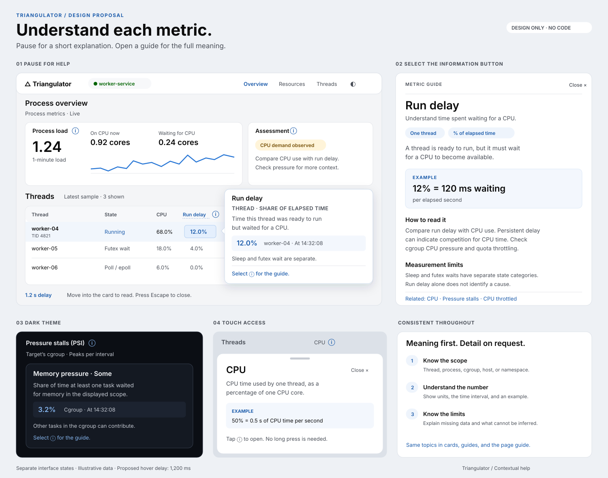

# Dashboard contextual help

Status: implemented in the dashboard. Follow
[Help for new dashboard features](#help-for-new-dashboard-features) when
you add or change a user-visible part of the page.

The goal is to help users understand each metric where they encounter it.
Keep the dashboard compact. Show a short explanation after a deliberate pause.
Let users open a longer guide when they need an example or measurement details.

The board shows separate states, not three panels open at once. Values are
illustrative. Keep the existing dashboard layout, typeface, and state colors.

## Three levels of information

| Level | Contents | Access |
| --- | --- | --- |
| Visible context | Name, unit, scope, time range, and data status | Always visible |
| Help card | Meaning, a contextual value when available, and one important limit | Hover or keyboard focus for 1,200 ms |
| Detailed guide | Meaning, worked example, how to read the result, measurement limits, and related metrics | Select the information button |

Use a small outlined information button next to section titles, metric labels,
chart titles, and table column names. Its accessible name is specific:
`Explain Run delay`. Keep the button visible. Give it a 28 × 28 CSS pixel target
on desktop and a 44 × 44 target on touch screens. The glyph itself is 16 pixels.

Metric values and table cells also expose the help card on hover. Do not add an
information button to every cell. A column guide explains its cells. Keep
sorting, row selection, and chart selection separate from the information button.
Use a thin dotted underline for a metric label that supports hover help. Do not
underline every number or whole row.

Retain short captions such as “Peaks per interval” and “Namespace-wide”. Keep
errors, stale data, missing coverage, and units visible. These facts must not
depend on discovering help. Place optional technical detail in the guide.

## Delay and interaction

1. Start a 1,200 ms timer when the pointer enters one help target. This is a
   proposed starting value for user evaluation, not an established optimum.
2. Cancel the timer when the pointer leaves. Start a new full timer for another
   target. Do not show subsequent cards faster because one card was just open.
3. For labels and cells, motion within the same target does not reset the timer.
   For a chart, require the same time bucket and series, with no movement beyond
   8 CSS pixels from the timer origin. A new point starts a new timer. For a
   multi-series time readout, the time bucket alone is the target.
4. Show one help card. Anchor it to the target, not to the moving pointer.
   Show the chart crosshair or target outline immediately, but wait the full
   delay before showing any floating value readout or explanation.
5. Let the pointer enter the card. Keep it open while the pointer is on the
   target, card, or the short bridge between them, or while its trigger has
   keyboard focus. Use a 250 ms close delay after both hover and focus leave.
   Text selection inside the card must work. There is no reading time limit.
6. Escape closes the card. Suppress reopening for that target until the pointer
   and focus leave it. Scrolling outside the card cancels pending help. Reposition
   an open card if its target remains visible and active; close it if the target
   leaves the viewport. Changing a filter, dragging a chart, changing replay
   time, or removing the target cancels pending help and closes the card.
7. Selecting an information button opens the guide immediately. Enter and Space
   do the same. This is an explicit request, so it has no hover delay. Opening
   the guide closes the help card and prevents automatic help until it closes.

Keyboard focus on an information button shows the same short help after the same
delay. Do not add hundreds of table cells to the Tab order. Keyboard users get
column definitions from the header buttons and thread-specific explanations in
the existing thread details view. Chart guide buttons provide a text explanation
and access to a data table. Where no data table exists, it is a future requirement.

On touch screens, tap the information button to open the guide. Do not require
a long press. Keep the existing tap action on rows and thread-map tiles.

Add one preference to the guide: **Show help on hover or focus**, on by default.
Turning it off removes automatic cards, including delayed chart readouts.
Explicit guide access remains available. Remember this preference in the browser.
Do not add a first-visit tutorial, automatic tour, or animated hover countdown.

## Card and guide appearance

| Element | Design |
| --- | --- |
| Help card | 320 px preferred width; up to 360 px; 16 px internal spacing; 12 px corners |
| Card placement | 8 px from target; prefer the side with space; flip and constrain to a 12 px viewport margin; keep the target visible |
| Type | Existing system font; 14 px body at 1.5 line height; 15 px semibold title; no essential text below 13 px |
| Content | Title; scope and interval; definition; optional captured value; one limit; at most about 80 words |
| Surface | Opaque `--surface`; `--ink` text; `--ink-2` secondary text; subtle border and shadow |
| Accent | Existing blue for information buttons and selection; state and warning colors retain their existing meanings |
| Motion | 120 ms opacity fade; no slide, bounce, or background blur; no transition with reduced motion |
| Desktop guide | 400 px preferred width, up to 440 px; right-side panel with its own scroll area |
| Small-screen guide | Full-width modal sheet, up to 90% of viewport height, with a visible Close button |

Use a noninteractive tooltip for the short card. It contains no links, buttons,
or focusable controls. Its last line can say “Select the information button for
the guide.” The information button belongs to the dashboard, outside the card.

On screens at least 1,200 CSS pixels wide, the guide is a nonmodal side panel.
Reduce the dashboard width and use its existing responsive layout. Do not dim
the dashboard. Below this width, use the modal sheet. On open, move focus to the
guide heading. A desktop guide does not trap focus; the modal sheet does.
Escape and Close return focus to the opener. If the opener is gone, return focus
to the section heading. Give both panel forms an accessible name.

Only one side panel occupies the existing thread-detail area. From an open thread
drawer, a guide temporarily replaces its contents and provides **Back to thread**.
Restore the same thread, range, and scroll position. Closing the guide also
restores those details. Selecting another thread from the dashboard closes the
guide and opens that thread. Do not stack two drawers or two scrims.

In dark mode, use the existing dark surface roles. Check text contrast at 4.5:1
and control boundaries and focus indicators at 3:1. At high zoom, let text wrap
and switch to the sheet. If a tooltip cannot fit, give it a bounded scroll area;
the same content must remain available through its guide.

## A consistent explanation

Each topic uses the same order. Omit a field when it adds no useful information.

1. **Meaning:** one plain sentence; expand an abbreviation on first use.
2. **Scope and interval:** thread, process, cgroup, host, or network namespace;
   latest interval, selected range, recorded snapshot, or cumulative total.
3. **Example:** show a unit and denominator. Clearly label invented values.
4. **How to read it:** one or two useful comparisons or next observations.
5. **Limits:** what this measurement cannot establish; missing-data behavior.
6. **Related:** at most three relevant topics, such as CPU, PSI, or thread state.

Never infer a cause from one value. Use “can indicate” where the cause is not
known. Do not label every high value as bad. A waiting worker can be normal.
Distinguish a measured value, a fixed assessment rule, and a suggested next check.

For contextual cards, capture the target identity, value, unit, source interval,
and timestamp when the card opens. Label it “At 14:32:08” rather than “Now”.
Keep the text stable while the dashboard updates. Preserve the target by its
logical identity across redraws. Do not let a table reorder put another thread
under the same open card. Close it if the target disappears or changes identity.
Recorded views use the recording timestamp. Show an interval only when known.

Unavailable values display **Not available**, with a reason only when supplied
by the data. A value of zero remains **0**. Partial coverage, fallback sources,
stale samples, and observation gaps are part of the explanation. Missing data
must never become an example of zero activity.

## Draft help text

These examples are content designs. Bind scope, interval, and status to the
actual displayed metric during implementation.

| Topic | Short explanation | Detail for the guide |
| --- | --- | --- |
| Thread CPU | CPU time used by this thread, as a percentage of one CPU core. | Example: 50% means 0.5 seconds of CPU time per elapsed second. Process CPU sums threads and can exceed 100%. |
| Run delay | Time this thread was ready to run but waited for a CPU, as a share of elapsed time. | Example: 12% means 120 ms waiting per elapsed second. Compare CPU and cgroup CPU pressure. Sleep and futex wait are different measurements. |
| Process load | Smoothed demand from this process: CPU use, runnable delay, and threads in uninterruptible kernel wait. | Explain the 1-, 5-, and 15-minute averages. A value of 1.00 represents about one core of demand. It is an estimate for this process, not the host load average. |
| Futex wait | The sampled wait channel indicates a futex wait, often used for synchronization. | A lock, condition variable, or timed idle wait can use futex. This sample alone cannot identify which one. |
| State mix | Share of observed samples in each thread state. | Sampling can miss short state changes. Sample share is not an exact trace of time spent in each state. Show the sample count and interval. |
| Pressure stalls (PSI) | Share of time tasks waited for CPU, memory, or I/O in the displayed scope. | “Some” means at least one task waited. “Full” means all non-idle tasks waited at once. Explain interval values, chart peaks, and the first-sample `avg10` fallback. Host CPU `full` is not useful as a stall measure. |
| Memory (RSS) | Resident set size: the process memory currently held in RAM. | Shared pages count in full. RSS is not private memory or the cgroup memory total. Growth alone does not establish a leak. |
| CPU throttled | Share of cgroup CPU periods in which the CPU quota was exhausted. | The denominator is CPU periods, not elapsed time. A value of 25% means throttling occurred in one quarter of the observed periods. |
| Recv-Q | Received data waiting to be read from this socket. | Use bytes for connected sockets. For a listener, use connections waiting for `accept()`. Never describe a listener queue as bytes. |
| Socket sent | Bytes accepted by the observed socket operations. | Acceptance does not prove delivery to the peer. Show observer coverage. Messages processed requires an explicit application completion marker. |
| Network drops | Selected drop counters from the target's network namespace. | Other processes can contribute. Explain the selected counter, unit, interval, and total separately. Do not attribute every drop to the target. |
| Inspect a moment | Inspect the nearest available recording at or before the selected local time. | Show requested and returned times, with timezone. A recording is not an interpolated frame. Recording can be disabled; stored summaries cannot reconstruct an exact snapshot. |

Example guide for **Run delay**:

> Time a thread was ready to run but waited for a CPU.
>
> **Scope:** One thread. **Unit:** Percentage of elapsed time.
>
> **Example:** 12% means 120 ms waiting per elapsed second. This is an example,
> not the measurement of a specific one-second interval.
>
> **How to read it:** Compare run delay with CPU use. Persistent delay can
> indicate competition for CPU time. Check cgroup CPU pressure and quota
> throttling for more context.
>
> **Limits:** This value does not include every form of waiting. Sleep and futex
> waits have separate state categories. It does not identify a cause by itself.
>
> **Related:** CPU · Pressure stalls · CPU throttled

## Coverage map

Provide one reusable topic per concept, with context for each occurrence.
Help for a table header explains the column. Help for a cell adds its value,
thread or socket identity, and measurement time. Help for a chart title explains
axes, aggregation, scope, gaps, and controls. Point help adds the selected time
and value. Legend help explains the series without changing its toggle action.

| Dashboard area | Topics to cover |
| --- | --- |
| Target and connection | Process name versus PID; name matching; session; connected, silent, and absent states |
| Inspect a moment | Local time and timezone; nearest earlier recording; Previous/Next; Live; recording disabled; missing history |
| Process load | Load averages; On CPU now; Waiting for CPU; busiest thread; chart window versus averaging window |
| Assessment | Meaning of each verdict; exact rule and observed value; scope; limits of the assessment |
| Overview tiles | Active/idle definition; context switches; disk and syscall I/O; major faults; thread churn; socket bytes; messages |
| State chart and wait bars | Every state; sampled counts; wait channels; filter action; unknown and no access |
| Thread map | Tile size and color; CPU averaging window; Now versus historical windows; thread selection |
| CPU groups and cores | Name family versus config group; thread CPU; last observed core; limits of attributing CPU by last core |
| Monitor health | Sample interval; last data; one-minute packet loss; bad, duplicate, and late packets; raw samples; session and address |
| Resource tiles | PSI scope; RSS, peak, swap, and growth; descriptors; block-layer disk I/O; queues; drops; retransmits; CLOSE-WAIT |
| Pressure chart and table | CPU/memory/I/O; some/full; host/cgroup; interval/avg10 fallback; peak aggregation; absent series |
| Limits and headroom | Soft descriptor limit; cgroup memory and events; CPU quota and throttled periods; PID limit; socket memory limits; unlimited/unknown |
| Queue chart | Receive/send bytes; target scope; time range; aggregation and missing samples |
| Network counters | Each counter definition; Now/In range/Total; namespace scope; resets and unavailable values |
| Fullest sockets | Socket kind/state; local/peer; Recv-Q/Send-Q; listener backlog; buffer fill; drops; RTT; retransmits; coverage |
| Thread filters and table | Group; sort; active/idle/all; TID and generation; wait channel; last ~10 s; CPU; run delay; switches; read/write; major faults; core |
| Thread drawer | Live versus stored history; five-second summaries; CPU/delay/state/I/O charts; range inputs; bucket time; samples; gaps |
| Socket I/O panel | Observer status and coverage; received/sent/messages; total/current/average/recent min/max; filters affect breakdown only; retired threads |
| Memory map | VmSize and its limit; anonymous/file/shared split; VMAs and vm.max_map_count; findings; address-space bars and kinds; region zoom and page grid; heap, main stack, and resident anonymous charts; region table; memory limits |
| Optional alerts | Rule meaning; threshold unit and window; trigger/recovery; disable and reset effects; delivery status when present |

Alerts remain in their separate program. Show their help only when that feature
is available. This design does not add alerts or new core metrics.

## Help for new dashboard features

Every user-visible section, card, chart, metric label, table column, legend,
and disclosure needs a help topic. Add the topic in the same change as the
feature. A feature without help is incomplete.

1. Reuse a topic when the concept is the same. Otherwise add one with
   `helpTopic(id, title, scope, meaning, example, reading, limits, related,
   aliases)` in `collector/dashboard.html`. Follow
   [A consistent explanation](#a-consistent-explanation).
2. Give static headings, columns, and summaries a `data-help` attribute, or a
   title or alias that names the topic exactly. Use `data-help` for generic
   text such as "Findings", "Total", or a heading with a runtime count.
3. Build runtime labels with `helpButtonLabel(text, id, className, tag)`, not
   `node('h3', …)`, `node('dt', …)` or a plain `.label` div. `initHelp` runs
   once, so it cannot reach labels created later.
4. Do not register a generic word, such as "Now" or "Total", as an alias. Each
   alias must select exactly one topic.
5. A full-width table message uses its panel heading. Set `data-help` on the
   cell if another topic explains it better.
6. Add the section to the [coverage map](#coverage-map) and a manual case in
   [test cases](qa/test-cases.md).

`tests/dashboard_test.js` fails when a static heading, column, or summary has no
topic. It also fails when runtime code builds a heading, fact, or tile label
without `helpButtonLabel`. These checks cannot see every hover target. Pause
over each new label in a browser before you open the pull request.

## Implementation boundaries for later work

Replace educational HTML `title` text and immediate custom hover readouts with
the shared delayed pattern. Do not show a native tooltip and a custom card at
the same time. Preserve accessible names, exact values, and truncated names.
Keep one content source per topic and reuse it in cards, guides, and the page
guide. Keep “How to read this page” as the entry point to the same topics.

Use `role="tooltip"` and `aria-describedby` for short cards. Keep focus on the
trigger. Do not announce every live sample through a live region. Guides have
their own heading and explicit open/close controls. Use modal semantics only
for the small-screen sheet. No collector or sampler change is needed to add
the help surfaces; explanations must use data already available to the view.

## Design acceptance checks

- A 1,199 ms hover shows no card. At 1,200 ms the card begins its fade. Moving
  across many cells never opens a card early. Repeated help uses the same delay.
- Moving into the card keeps it readable. Escape works without moving the
  pointer. Dismissed help does not immediately reopen. Only one card is visible.
- Hover does not change sorting, filters, selection, or keyboard focus.
- Tab, Enter, Space, Escape, touch, zoom, and reduced motion all have defined
  paths. Column and chart guides provide equivalent information without hover.
- A refresh or row reorder preserves the correct target or closes its card.
  A frozen explanation shows its timestamp while the dashboard continues.
- Zero, missing, stale, partial, replay, host fallback, and listener cases use
  the correct explanation. Filters do not silently change the stated scope.
- The desktop guide and thread drawer never overlap. Back restores the thread.
  The sheet has a visible Close button and restores keyboard focus.
- Check light and dark themes, viewport edges, narrow screens, and 200%/400%
  zoom. No title, unit, or close control is clipped.
- In a later usability check, ask users to explain CPU above 100%, run delay,
  PSI scope, and missing data. Check whether 1.2 seconds is easy to discover
  without causing unwanted cards. No usability test has been run for this design.

## Basis

Dashboard scope and terminology come from [the current dashboard](../collector/dashboard.html),
[resource monitoring](resource-monitoring.md), and
[historical inspection](collector-reference.md#historical-process-inspection).

The hover behavior follows the dismissal, pointer access, and persistence
guidance in [W3C: Content on Hover or Focus](https://www.w3.org/WAI/WCAG22/Understanding/content-on-hover-or-focus.html).
The separation between noninteractive cards and guides follows the
[WAI-ARIA tooltip pattern](https://www.w3.org/WAI/ARIA/apg/patterns/tooltip/).
The APG tooltip pattern is marked as work in progress. The 1,200 ms delay,
dimensions, and panel layout are design choices in this proposal.
