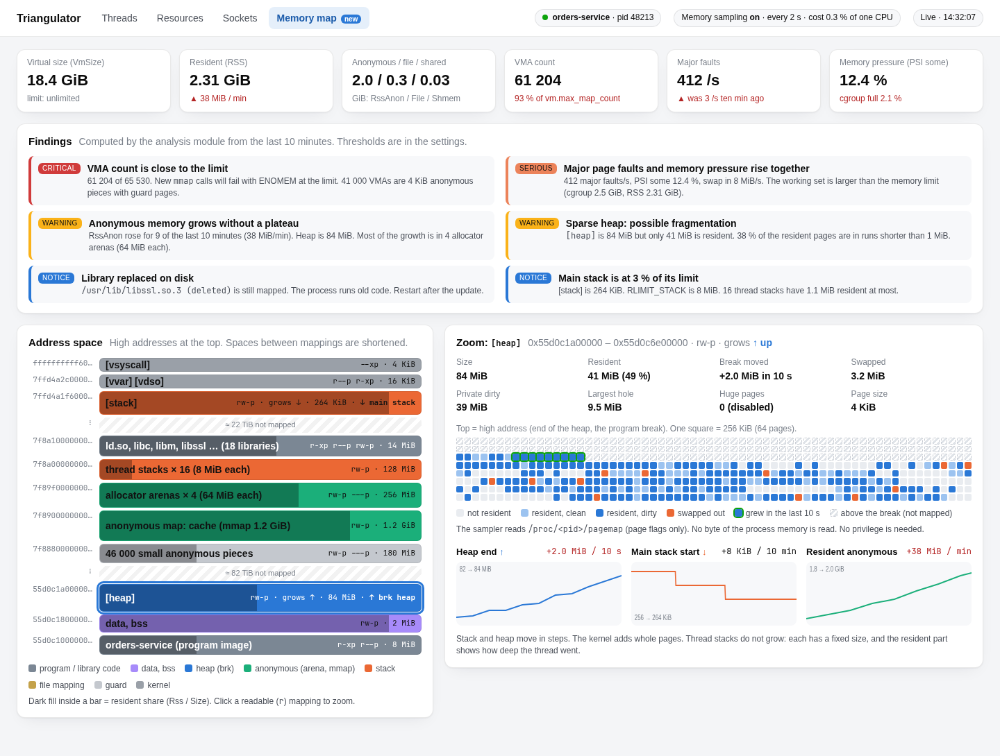
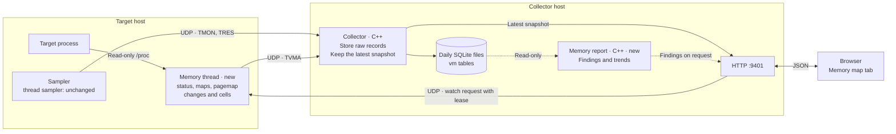

# Process memory map: design

Status: final design, reviewed. Section 16 lists the changes that the review
made.

This document describes a new dashboard tab, **Memory map**. The tab shows the
virtual address space of the target process. It shows the heap, the stacks, the
libraries and all other mappings. The user can select one mapping and zoom in to
see its pages. The tab also reports memory pressure, fragmentation and other
virtual-memory problems.

The design needs **no privilege**. The sampler runs as the target user. It reads
only files that the same user can read.



The source of the picture is [mockups/process-memory-map.html](mockups/process-memory-map.html).
The mock-up uses invented numbers. Open the file in a browser to see it. The
mock-up was made before the review. Two parts of it do not match the design
now: the resident fill on every bar (section 10) and the clean and dirty page
cells (section 6).

## 1. Background: the virtual address space

Each Linux process sees its own range of addresses. The kernel splits this range
into **VMAs** (virtual memory areas). A VMA is one block of addresses. All
addresses in one VMA have the same permissions and the same backing.

On x86-64 the usual layout is as follows. High addresses are at the top.

```text
high   [vsyscall] [vvar] [vdso]        kernel helpers
       [stack]                         main stack. Grows DOWN.
       ... large unmapped gap ...
       thread stacks                   fixed size. Do not grow.
       allocator arenas, big mmaps     anonymous memory
       libraries (code, data)          file-backed
       ... unmapped gap ...
       [heap]                          brk heap. Grows UP.
       data, bss
low    program code                    file-backed
```

Four terms matter for the rest of this document:

- **Mapped** means the kernel has a VMA for the address. It does not mean that
  RAM is in use.
- **Resident** means a page is in RAM now. The kernel gives RAM to a page only
  when the program first touches it.
- **Swapped** means the kernel moved the page to disk.
- **Dirty** means the program changed the page.

A process can map 18 GiB and use 2 GiB of RAM. The tab shows both numbers.

## 2. What the sampler can read without privilege

All sources below are readable by the same user. None of them needs `sudo`,
`CAP_SYS_PTRACE` or `ptrace` attach. See
[proc(5)](https://man7.org/linux/man-pages/man5/proc.5.html) and the
[pagemap guide](https://docs.kernel.org/admin-guide/mm/pagemap.html).

| Source | What it gives | Cost |
|---|---|---|
| `/proc/<pid>/maps` | Start, end, permissions, file offset, inode, path, names such as `[heap]` and `[stack]` | Low |
| `/proc/<pid>/smaps` | Per VMA: Size, Rss, Pss, shared and private pages, dirty pages, swap, huge pages, `VmFlags` (for example `gd` = grows down) | High. The kernel walks the page tables. |
| `/proc/<pid>/smaps_rollup` | The totals of `smaps` | Medium |
| `/proc/<pid>/pagemap` | Per page: present, swapped, exclusive, file or shared. The frame number is hidden without `CAP_SYS_ADMIN`. The file is indexed by address, so the sampler can read the pages of one VMA only. | Medium |
| `/proc/<pid>/status` | VmSize, VmRSS, RssAnon, RssFile, RssShmem, VmSwap, VmPTE, VmLck | Low |
| `/proc/<pid>/stat` | `minflt`, `majflt`, `startstack`, `vsize` | Low. The sampler reads it already. |
| `/proc/<pid>/limits` | RLIMIT_AS, RLIMIT_STACK, RLIMIT_MEMLOCK | Low |
| `/proc/sys/vm/max_map_count` | The maximum number of VMAs for one process | Low |
| `/proc/pressure/memory` and cgroup `memory.pressure` | Memory pressure (PSI). The sampler reads it already. | Low |
| `/proc/meminfo`, `/proc/vmstat`, `/proc/buddyinfo` | Host memory, reclaim and compaction counters, free blocks by order | Low |

### What the sampler cannot read without privilege

- **The bytes of the memory.** `/proc/<pid>/mem` and `process_vm_readv` need
  `ptrace` attach rights. Yama `ptrace_scope=1` blocks them. This version does
  not show bytes. It shows page state only.
- **The stack pointer.** The sampler cannot see how deep a thread is in its
  stack. It sees the resident part of the stack. This shows the deepest point
  that the thread reached (the high-water mark).
- **Physical addresses.** The sampler cannot see where a page is in RAM. It
  cannot measure the physical fragmentation of one process. It can measure the
  physical fragmentation of the host with `/proc/buddyinfo`.
- **The state of the allocator.** The sampler cannot see which heap bytes are
  live and which bytes the program freed. Heap fragmentation findings are
  therefore indicators, not proof.
- **Processes that are not dumpable.** The kernel gives these `/proc` files to
  root. The tab shows "no access" for them, not zero.
- **Whether a page is dirty.** `pagemap` has a soft-dirty bit, but it is not
  the dirty bit. Without `clear_refs` (which the design forbids, section 11)
  the kernel sets soft-dirty on every page that was ever written. The page
  cells therefore show resident, swapped and shared pages, not dirty pages.

### Why `smaps` is not used

The first version of this design read `smaps` for the selected VMA. `smaps`
cannot do that. It is a sequential text file. To get to the entry of one VMA,
the kernel must walk the page tables of **every VMA before it**. A read of
"one" VMA is then nearly as expensive as a read of all of them.

`pagemap` is indexed by address. The sampler can seek to the start of the
selected VMA and read only its pages. From the page bits it computes the
resident, swapped and shared sizes of the VMA. It does not get Pss or the dirty
size. The design accepts this.

## 3. How the tab shows growth

The kernel does not announce growth. The sampler **reads `maps` again and
compares the two results**.

| Area | Direction | What changes | What the sampler sees |
|---|---|---|---|
| `[heap]` (brk) | Up | The end address of the VMA | The end address rises when the allocator calls `brk`. |
| `[stack]` (main) | Down | The start address of the VMA | The start address falls when the kernel expands the stack on a page fault. It never rises. |
| Thread stacks | None | The size is fixed (8 MiB by default). A guard page is below it. | The resident size rises as the thread goes deeper. |
| Allocator arenas and big `mmap` blocks | None | New VMAs appear. Others disappear. | VMA added and removed events. |

The change is in steps of whole pages. The tab shows a growth arrow and a
time chart for the end of the heap and the start of the stack.

glibc `malloc` uses `brk` only for the main arena. It uses `mmap` for large
blocks and for the arenas of other threads. The tab therefore shows the arenas
and the large maps next to the heap.

The sampler cannot name thread stacks with certainty. The kernel removed the
`[stack:tid]` label in Linux 4.5. The tab labels a block as a probable thread
stack when it is anonymous, `rw-p`, near the stack size limit, and has a guard
VMA below it.

## 4. Where the code runs

The project rules in [AGENTS.md](../AGENTS.md) apply:

- Fast and performance-critical code is C++ or Rust.
- The core collector does not get unrequested features.
- Analysis, reports and richer dashboard data are separate programs. They read
  SQLite read-only or use the HTTP API. They never read the UDP stream.
- `smaps` stays off the per-thread sampling path
  ([linux-monitoring.md](linux-monitoring.md)). This design does not read
  `smaps` at all (section 2).

### Options

| Option | Description | Advantage | Disadvantage |
|---|---|---|---|
| **A. A thread in the sampler** | The sampler starts one extra thread when the feature is on. The thread reads `/proc` and sends `TVMA` datagrams. | One program to deploy. Same target lookup, same session, same UDP path. Works when the collector runs on another host. Summaries and evidence snapshots go to SQLite. | A bug in the new code can stop the thread sampler. The sampler is no longer single-threaded. |
| **B. A separate sampler program** | A new binary, like `socket_sampler/`. | The failure of one program does not stop the other. The user can limit it with `nice` or a cgroup. | One more program to deploy. It needs its own target lookup. |
| **C. A helper on the collector host, started on request** | Like `SocketReportBridge`. The HTTP thread starts a helper, which reads `/proc` once. | The user can select any range at any time. No new wire format. | The target must be on the same host. No history. Python or C++ start-up cost for each request. |

### Recommendation

Use **option A** for version 1, with these conditions:

1. The feature is **off by default**.
2. The new thread has bounded memory, bounded time and no exceptions. Fallible
   functions return `std::expected`.
3. The parsers and the memory thread are in headers under `sampler/`, as
   `sampler/resource_parsing.hpp` is. Nothing is inside `sampler/main.cpp`. If
   the thread causes trouble, the code moves to option B with little change.
4. The thread backs off by itself when a read is slow (see section 11).

Option C is a possible later addition for local targets that need an arbitrary
zoom range.

## 5. Data flow



Each part has one job:

1. **The memory thread** reads facts. It does not judge them.
2. **The collector** stores the raw records. It keeps the latest snapshot in
   memory. It computes no findings.
3. **The memory report** reads SQLite and computes findings. It runs in its own
   process, so a slow analysis cannot delay the collector.
4. **The browser** gets the latest snapshot for the live view. It asks for
   findings less often.

The HTTP thread of the collector sends the watch requests, not the UDP loop. A
request is one non-blocking `sendto`, so it cannot delay the UDP loop.

## 6. The sampler memory thread

The sampler starts the thread when `memory_map_enabled = true` (section 14). The thread
then **blocks** until a request arrives. While it blocks, it uses no CPU and
reads nothing from the target.

### Control: the request channel

The thread waits in `poll()` on a control socket. The collector sends small UDP
requests to this socket.

| Field | Content |
|---|---|
| Action | `watch` or `stop` |
| Tier | `layout` (tiers 0 and 1) or `detail` (tier 2, see below) |
| Lease | Seconds. The sampler limits it to `max_lease_s` (default 15). |
| VMA start | For `detail` only. The start address of the selected VMA. |
| Counter | The wall-clock time of the collector in nanoseconds. The sampler ignores a request whose counter is not larger than the last accepted counter. |
| HMAC | HMAC-SHA256 of all other fields, computed with a shared token. |

Rules for the channel:

1. A request never holds a PID or a path. The target is always the process in
   `sampler.toml`. The only actions are the fixed list above.
2. The sampler accepts a request only from the host of its `collector` address,
   with a valid HMAC. It limits the request rate.
3. The counter is a clock time, not a number that starts at 1. A restarted
   collector therefore continues with larger counters, and the sampler accepts
   them. A restarted sampler accepts any first counter. A replayed old request
   can then start one lease, which is the worst case in rule 7 below.
4. The default listen address is `127.0.0.1`. A remote collector needs an
   explicit `memory_map_listen` address.
5. The request has a **lease**. While a browser has the tab open, it calls
   `POST /api/memory-map/watch` every 5 s, and the collector sends one `watch`
   for each call. If the lease ends, the thread stops and blocks again. A
   forgotten tab cannot keep the sampling on.
6. The sampler sends no reply. The `TVMA` stream is the reply. The tab shows
   "waiting for the sampler" until the first datagram arrives.

7. This is the first inbound path to the sampler. The pull request that adds
   it must include a short threat review. The worst case for an attacker who
   passes the checks is a bounded read of the configured target.

The sampler has no crypto library and must stay without dependencies. SHA-256
and HMAC are short; the implementation is a header with the test vectors of
FIPS 180-4 and RFC 4231.

The memory thread blocks every signal. The kernel then gives `SIGHUP`, `SIGINT`
and `SIGTERM` to the main thread only, which sleeps in `clock_nanosleep` and
wakes at once.

The keys, defaults and checks are in section 14. A reload that changes only
`memory_map_*` keys must **not** start a new session.

On the collector side, `sampler_control` gives the address of the control socket.
The HTTP endpoint `POST /api/memory-map/watch` sets the lease. The tab calls it
while it is open.

### Three tiers of work

Each tier takes more of the target's memory-map lock (section 11).

| Tier | Reads | Runs when | Risk to the target |
|---|---|---|---|
| 0 | `status`, `stat`, `limits` | The lease is active | None. These reads take no `mmap_lock`. |
| 1 | `maps`, in small reads | The lease is active | Short lock holds |
| 2 | `pagemap` for **one** selected VMA | Only after the user selects the VMA | Short lock holds in a bounded burst |

Tiers 0 and 1 give the whole growth view: the end of the heap, the start of the
stack, the VMA list and the totals. Tier 2 gives the page grid and the resident
size of the selected VMA. Tier 2 never runs on its own.

Tiers 0 and 1 cannot give the resident size of each VMA. Only `smaps` or a
`pagemap` read of the whole address space gives it, and both cost too much
(section 2). The address-space view therefore shows the size of each VMA, and
the resident share of the selected VMA only.

### One cycle

1. Tier 0: read `status`, `stat` (fault counters) and `limits`.
2. Tier 1: read `maps` in small `read` calls (default buffer: 4 KiB). Parse with
   a fixed buffer, without allocation in the loop.
3. Compare with the previous cycle. Mark each VMA as new, removed, resized or
   unchanged.
4. Tier 2, on request only: read `pagemap` for the address range of the
   selected VMA in small windows. Reduce the result to at most 512 **cells**.
   One cell covers a fixed number of pages. It holds the fractions of resident,
   swapped and shared pages. A large VMA can need more reads than the burst
   budget allows. The thread then continues in the next cycle where it
   stopped. Cells that it did not read yet are marked "not measured".
5. Send datagrams. Do not retry. Do not buffer on disk.

`PROCMAP_QUERY` (Linux 6.11 and later) returns one VMA for an address, without
text parsing. Version 1 uses the text parser only, because it works on every
supported kernel. `PROCMAP_QUERY` is a later improvement.

### Limits

| Limit | Default | Reason |
|---|---|---|
| `interval_s` | 2 | The growth of the heap is visible at this rate. |
| `keyframe_s` | 30 | The sampler sends the full VMA list at least this often. A lost datagram is corrected within 30 s. |
| `max_vmas` | 8192 | Some processes have more than 60 000 VMAs. The sampler sends a summary and the largest VMAs, and sets a `truncated` flag. Tier 2 needs a confirmation above this number. |
| Read size | 4 KiB for `maps` | A small read holds the lock for a short time. |
| Slow-read limit | 2 ms | The thread times each read. A slow read doubles the sleep time between reads, up to 50 ms. |
| Burst budget | 50 ms total | The thread stops a tier 2 burst above this time and sends what it has. |
| Pages per burst | 262 144 (2 MiB of `pagemap`) | A second bound for tier 2, which does not depend on the clock. |
| Cells per VMA | 512 | 512 cells fit in 2 datagrams. |

## 7. Transport: the `TVMA` datagram

Use a new format. Do not reuse the `TMON` or `TRES` fields
([linux-monitoring.md](linux-monitoring.md) requires this). Follow the pattern of
`common/resource_wire.hpp`: a fixed header, a version, and parts that share the
header.

Outline (the implementation pull request fixes the exact layout):

| Part | Content | Size |
|---|---|---|
| Header | Magic, version, kind, part number, part count, session, sequence, timestamps, PID, layout generation, flags (such as `truncated`) | 64 bytes |
| Summary | Values from `status`, `stat`, `limits`, `vm.max_map_count`; VMA count; read cost | Fixed list of `u64` values. `kUnavailable` means "not readable". |
| VMAs | Start, end, file offset, inode, device, permissions, kind, change marks, and the last 48 bytes of the path | 96 bytes per VMA, 13 per datagram |
| Detail | Start of the selected VMA, resident, swapped and shared sizes, scan progress, and the cells (1 byte each for resident, swapped and shared, in 1/255 steps) | 2 datagrams for 512 cells |

The path is in the VMA record. There is no name table, so a lost datagram
cannot make a name unknown. Most paths fit in 48 bytes. For a longer path the
record keeps the end, because the file name is the important part.

There are no delta records. The sampler counts a **layout generation**. The
generation rises when a VMA appears, disappears or changes. Each cycle sends the
summary. The VMA parts are sent only when the generation changed, or when
`keyframe_s` passed since the last full list. A process with a stable layout
therefore costs one or two datagrams per cycle.

`common/memory_wire.hpp` has the exact layout. In short:

| Part | Bytes | Notes |
|---|---|---|
| Header | 64 | `TVMA`, version 1, kind, part, parts, count, sequence, session, clocks, PID, interval, process start time, generation, flags, `layout_parts` |
| Summary (part 0) | 64 + 46 × 8 = 432 | Field names in `kSummaryFields` |
| VMAs (parts 1 to `layout_parts`) | 64 + 13 × 96 = 1312 at most | Sent when the generation changed or `keyframe_s` passed |
| Detail (the last parts) | 64 + 80 + 256 × 3 = 912 at most | Only while a VMA is selected |

The request is one 64-byte `TVMQ` datagram: version, action, tier, lease,
counter, VMA start and a 32-byte HMAC-SHA256 of the first 32 bytes.

UDP can lose datagrams. The design handles this in two ways:

1. The collector uses a VMA list only when all its parts arrived. Otherwise it
   keeps the previous list and marks it as older than the summary. The tab
   shows "layout stale" until a complete list arrives, at the latest after
   `keyframe_s`. A missing part never means "the VMA is gone".
2. The summary carries the generation of the layout that the sampler sees.
   When it differs from the generation of the stored list, the tab knows that
   its list is old.

## 8. The collector

The collector does three things. It does not interpret the data.

1. It decodes `TVMA` datagrams and reassembles the parts.
2. It writes **raw records** to SQLite (see below).
3. It keeps the **latest full snapshot** in memory and serves it with
   `GET /api/memory-map`.

`GET /api/memory-map` returns the summary, the list and the detail as compact
arrays. A list of 8192 VMAs is about 600 KB of JSON. The tab asks for it once
each 2 s, and only while it is open.

### SQLite tables

The tab is mostly live. The sampler reads only while someone watches, so the
database holds little. It keeps only important data:

| Table | One row for | Content |
|---|---|---|
| `vm_summary` | Each minute of watching | The summary values. About 100 bytes. |
| `vm_snapshot` | Each evidence snapshot | The full VMA list as JSON. The collector writes the first complete list of each watch, and then at most one each hour. |

The first design also wrote a snapshot "when a finding opens". That is not
possible: the collector computes no findings, and the memory report only reads
the database. The first list of each watch is the replacement.

The database holds **no page cells** and no continuous VMA history. The
retention is 7 days by default (setting: `[memory_map] retention_days`). It
cannot be longer than the `retention_days` of the collector, because the
collector deletes the whole day file then.

Replay shows the stored snapshots and summaries. It is not a continuous record.
When the time selector inspects a past moment, the section asks
`GET /api/memory-map/replay?at=T`. The collector returns the newest summary and
the newest VMA list at or before `T`, and the section says how old each is. The
page cells are not stored, so a selected mapping shows no pages. The findings
panel asks the report for the same time (`triangulator-memory-report DIR PID
AT`), so it judges what was known then.

## 9. The memory report

The first design used a Python program for the findings. The review changed it
to a C++ program, `triangulator-memory-report`, built from `metrics/` like
`triangulator-socket-report`. Deployment is a copy of binaries, and a
collector host does not need Python (see the README). The rule for reports and
richer dashboard data still applies: the program reads the SQLite day files in
read-only mode and never reads the UDP stream.

The collector starts the program through a bounded bridge, as it does for the
socket report. A slow or failed report cannot delay the UDP loop. If the
binary is not next to the collector, the tab still shows the map and the
numbers. It hides the findings panel.

The sampler reads the memory map only while someone watches, so `vm_summary`
and `vm_snapshot` have gaps. The trend findings therefore use the tables that
the collector writes all the time: `resource_sample` (memory, swap, pressure,
cgroup) and `thread_rollup` (major faults). They work also when nobody watched
before.

The thresholds below are defaults. Version 1 has them as constants in the
program. Settings for them are a later change.

| Finding | Source | Rule |
|---|---|---|
| VMA count near the limit | `vm_summary`: VMA count, `vm.max_map_count` | Warn at 80 %. Critical at 90 %. At the limit, `mmap` fails with `ENOMEM`. |
| Address space near the limit | `vm_summary`: `VmSize`, RLIMIT_AS | Warn at 80 %. |
| Stack near its limit | `vm_summary`: `stack_start`, `stack_end` and RLIMIT_STACK (newer than the stored list) | Warn at 50 %. Critical at 80 %. |
| Resident memory grows without a plateau | `resource_sample`: `rss_bytes` (the table has no anonymous share) | Over the last 10 minutes, the value rises in at least 90 % of the steps, and by more than 1 MiB per minute. This is a **suspicion** of a leak, not proof. |
| Memory pressure | `resource_sample`: PSI `some` and `full` for the host and the cgroup | `some` above 10 % is serious. Any `full` above 0 is serious. |
| Major page faults rise | `thread_rollup`: `major_faults_delta` | The rate of the last 5 minutes is above 10 per second and above 4 times the median of the last hour. |
| Swap in use | `resource_sample`: `swap_bytes` | The process has pages in swap, and the value rose in the last 10 minutes. |
| Little room in the cgroup | `resource_sample`: `cgroup_memory_current`, `cgroup_memory_max`, `cgroup_memory_max_events`, `cgroup_memory_oom_kill` | Above 90 % of the limit, or the `max` or `oom_kill` counters rose. |
| Many small VMAs | `vm_snapshot` | More than 50 % of at least 1000 VMAs are 4 KiB to 64 KiB. This often means many guard pages or many tiny `mmap` calls. |
| Arena count | `vm_snapshot`: anonymous 64 MiB regions | More than 8 times the CPU count. This matches the glibc default arena limit. |
| Stale library | `vm_snapshot`: the path ended with `(deleted)` | The process runs code that the package manager replaced. Restart it. |
| Writable and executable memory | `vm_snapshot`: permissions `rwx` | Report it. JIT compilers cause it. Other programs should not. |

The review removed three findings from version 1:

- **Sparse heap.** It needs the page cells, and the database does not store
  them (section 8). The zoom view shows the resident share and the cells of
  the heap, so the user can see the same thing.
- **Huge page trouble** and **host fragmentation.** They need `/proc/vmstat` and
  `/proc/buddyinfo`, which no part of Triangulator reads yet. They are host
  facts, so they belong in the resource sample, which is a separate change.

Notes for the reader:

- **Virtual fragmentation** is about the address space. It shows as many small
  VMAs and small gaps between them. It can cause `mmap` failures even when RAM
  is free.
- **Heap fragmentation** is about the allocator. Free memory is in many small
  pieces. The process uses more RSS than its live data needs. Without `ptrace`
  the tab can show only the indicator in the table above.
- **Physical fragmentation** is about RAM. It makes large contiguous
  allocations fail. Only the host view (`/proc/buddyinfo`) can show it. Version
  1 does not.

## 10. The dashboard tab

The tab has four parts. See the mock-up.

1. **Tiles.** VmSize, RSS, RSS by type, VMA count, major faults, memory pressure.
2. **Findings.** A list with severity. Each finding explains the evidence in one
   or two sentences.
3. **Address space.** One bar for each VMA or group of VMAs, with high addresses
   at the top. Long gaps are shortened and labeled. Click a readable mapping to
   select it. The fill shows the resident share of the selected VMA only
   (section 6).
4. **Zoom.** The page grid of the selected VMA, with the facts and three time
   charts (end of heap, start of stack, resident anonymous memory). The page
   cells show resident, swapped, shared and not measured pages.

Rules for the page:

- Use the existing colors and fonts of the dashboard. Do not load anything from
  the network.
- Do not use color alone. Each state also has a label or a pattern.
- Show "not readable" for unavailable data. Never show zero.
- Poll the live endpoint about once each 2 s only while the tab is open.
- The dashboard is one page with a link for each section. "Open" means that the
  **Memory map** section is on the screen and the browser tab is visible. The
  page renews the lease only then.

## 11. Observer effect: the memory-map lock

### What the lock is

Each process has one `mmap_lock`. It is a read/write lock on the list of VMAs.

- **Readers** share the lock. They are: page-fault handling on older kernels,
  and reads of `/proc/<pid>/maps`, `smaps` and `pagemap`. This design reads
  `maps` and `pagemap` only.
- **Writers** need the lock alone. They are: `mmap`, `munmap`, `mprotect`, `brk`,
  `mremap` and stack growth.

A waiting writer blocks all new readers. The stall can therefore spread:

1. The sampler reads `maps` or `pagemap`. It holds the read lock.
2. A target thread calls `mmap`. It waits for the lock.
3. Other target threads page-fault. On older kernels, they queue behind the
   waiting writer.
4. The whole target stops for the time of step 1.

Userspace cannot ask for "try the lock". After a `read()` starts, the sampler
cannot stop it. The stall is the length of **one lock hold**, not of the whole
scan.

### How long a hold is

| Source | Lock hold |
|---|---|
| `status`, `stat`, `limits`, `statm` | No `mmap_lock`. |
| `maps` | Per `read()` call. The kernel takes the lock at the start of the call and drops it at the end. A small buffer means a short hold. Newer kernels reduce it more (per-VMA locks, `PROCMAP_QUERY`). |
| `smaps` | Per `read()` call. Each VMA entry is large, so a large buffer covers many VMAs. To get to one VMA, the kernel walks all VMAs before it. **Not used.** |
| `smaps_rollup` | The whole walk in one hold. **Never use it for large processes.** |
| `pagemap` | Windows of a limited address range. The kernel walks at most 512 pages per lock hold (`PAGEMAP_WALK_SIZE`) on the supported kernels. The sampler reads 512 entries (4 KiB) per `read()`. |
| `clear_refs` | A write lock and extra page faults. **Never use it.** |

The kernel version changes the risk. Since Linux 6.4, most page faults use
per-VMA locks. Then only `mmap`, `munmap`, `brk` and similar writers wait. Older
enterprise kernels (for example 4.18 and 5.14) make every faulting thread wait.
The sampler reads the kernel version and uses stricter limits on old kernels.

Do not give the memory thread a very low priority (`SCHED_IDLE` or a high nice
value). If the kernel pauses the thread while it holds the lock, the target
stays blocked for the whole pause. Keep each read short. Sleep between reads.

### What the design promises

The sampler cannot read `maps` or `pagemap` with zero effect on the
target. The design gives three guarantees instead:

1. **No cost when nobody looks.** The thread blocks until a request arrives. The
   lease ends the work when the tab closes.
2. **A bound.** The tiers (section 6) keep the heavy reads for one selected VMA.
   Reads are small. The thread sleeps between them. A burst has a time budget.
3. **A measurement.** The thread times each read, because a read time shows the
   lock hold. It backs off when a read is slow. It sends the cost to the
   collector, and the tab shows it.

### Other safety rules

1. The thread never writes to the target.
2. A VMA can disappear between two reads. A process can exit. The thread treats
   `ENOENT`, `ESRCH` and `EIO` as normal results.
3. The zoom button shows a warning: "This briefly locks the target memory map."

### Acceptance test

A test target does `mmap`, `munmap` and page faults in a loop and records the
latency of each call. The memory thread reads `maps` and `pagemap` at the same
time. The pull request for the sampler thread must report the extra latency at
p50, p99 and the maximum, on a 6.x kernel and on an older kernel. The project
sets the pass limit from these results.

### Results

`make memory-map-latency` runs the test (`tests/memory_map_latency.cpp`). The
target has 20 000 small mappings and a populated 1 GiB mapping. The reader
runs tiers 0, 1 and 2 (on the 1 GiB mapping) back to back, with no pause:
about 46 cycles each second, against one cycle each 2 s by default.

Linux 7.2, x86-64:

| Call | Without the reader: p50 / p99 / max | With the reader: p50 / p99 / max |
|---|---|---|
| `mmap` | 1.4 / 2.0 / 31 µs | 1.5 / 24 / 484 µs |
| Page fault | 1.1 / 3.1 / 165 µs | 1.1 / 3.2 / 171 µs |
| `munmap` | 5.3 / 8.3 / 43 µs | 6.6 / 23 / 284 µs |

Page faults do not change: this kernel uses per-VMA locks for faults. `mmap`
and `munmap` wait for the reader at most about 0.5 ms. No older kernel (for
example 4.18 or 5.14) was available for this test. On those kernels page
faults also wait for the lock. The pass limit for them is still open.

## 12. Plan

Status: steps 1 to 7 are done. The finding thresholds are constants in
`metrics/memory_report.hpp`.

Each step is a separate commit. Each commit builds and passes `make check`
alone. The steps can go in one pull request or in several.

1. **Parsers.** `maps`, `pagemap`, `status`, `stat` and `limits` parsers in
   `sampler/` with unit tests that use fixture text. No sampler change.
2. **`TVMA` wire format and request format.** Encoders and decoders with
   round-trip tests. The request has the HMAC.
3. **Sampler thread.** The `memory_map_*` configuration, the blocking thread, the
   control socket, the lease, the tiers, the read timing and back-off, and the
   rule that a `memory_map_*` reload keeps the session. Add the commented keys to
   `config/sampler.toml` and check them with `--check-config`. Include the threat
   review and the **acceptance test** from section 11.
4. **Collector.** The `[memory_map]` section, decode, keep the snapshot, `sampler_control`,
   `POST /api/memory-map/watch`, `GET /api/memory-map` and the SQLite tables.
5. **Tab, version 1.** Tiles, address space bar, zoom grid and growth charts.
   No findings yet.
6. **Memory report.** `triangulator-memory-report`, the bridge and the findings
   panel.
7. **Replay of snapshots.** Connect the tab to the time selector for the stored
   snapshots.

## 13. Decisions

The project owner made these decisions:

1. **Control channel.** The sampler gets a real-time request channel. The memory
   thread blocks until it receives a request (section 6).
2. **Defaults.** `interval_s` is 2 and `keyframe_s` is 30.
3. **Retention.** The tab is mostly live. The database keeps only summaries and
   evidence snapshots, for 7 days (section 8).
4. **Thread or program.** A thread in the sampler.
5. **Gating.** The feature is off unless the configuration turns it on, in both
   the sampler and the collector (section 14). There is no compile-time switch.

## 14. Configuration and gating

The whole feature is **off unless the configuration turns it on**. The code is
always part of the build, so `make check` tests it. No compile-time switch is
needed.

### What "off" means

| Program | When the feature is off |
|---|---|
| Sampler | It starts no memory thread. It opens no control socket. It reads no extra `/proc` file. The behavior is the same as today. |
| Collector | It opens no sampler-control path. It creates no `vm_*` tables. `GET /api/memory-map` returns `404`. |
| Dashboard | The **Memory map** tab is hidden. |

### Sampler keys (`sampler.toml`)

The sampler parser reads flat keys without sections and rejects unknown keys. The
new keys follow that style. A reload that changes only `memory_map_*` keys must
**not** start a new session. It only starts, stops or changes the memory thread.

| Key | Default | Rule |
|---|---|---|
| `memory_map_enabled` | `false` | `true` or `false`. |
| `memory_map_listen` | `"127.0.0.1:9402"` | A numeric IPv4 or `[IPv6]` address and a port. A non-loopback address needs an explicit value. |
| `memory_map_token_file` | none | Required when the feature is on. The file must belong to the sampler user and must not give access to other users (mode `0600` or `0400`). The sampler refuses to start with a wrong mode. The file holds one line of at least 32 characters. |
| `memory_map_interval_s` | `2` | 1 to 60. |
| `memory_map_keyframe_s` | `30` | 5 to 300, and not less than the interval. |
| `memory_map_max_vmas` | `8192` | 256 to 65536. |
| `memory_map_max_lease_s` | `15` | 5 to 60. |

Validation rules:

1. If `memory_map_enabled` is `true` and there is no valid token file, the
   configuration is invalid. At startup the sampler refuses to start. On
   reload, it keeps the previous configuration and logs the reason.
2. `--check-config` runs all of these checks.
3. A request channel always needs the token, also on loopback. Other local users
   can send UDP to loopback.

### Collector keys (`collector.toml`)

The collector uses a TOML section.

```toml
[memory_map]
enabled = false                   # off by default
sampler_control = "10.0.0.7:9402" # the sampler memory_map_listen address
token_file = "/etc/triangulator/memory-map.token"
retention_days = 7                # 1 to 90
```

| Key | Default | Rule |
|---|---|---|
| `enabled` | `false` | Turns on the endpoints, the tables and the tab. |
| `sampler_control` | none | Required when enabled. Host and port of the sampler control socket. |
| `token_file` | none | Required when enabled. The same token as the sampler. Same mode rule. |
| `retention_days` | `7` | 1 to 90, and not more than the top-level `retention_days`. |

If `triangulator-memory-report` is not installed, the tab hides the findings
panel only.

### Status shown in the tab

The tab shows one of these states. It never shows empty data without a reason.

1. **Disabled in the collector.** The tab is hidden.
2. **Waiting for the sampler.** No `TVMA` datagram arrived yet. The usual causes
   are: the sampler feature is off, a wrong token, or a blocked port.
3. **Live.** Data arrives. The tab shows the read cost.
4. **Stale.** The data stopped. The lease ended or the datagrams were lost.

## 15. Limits of this design

- Without `ptrace` the tab shows page state, not bytes. It does not show stack
  depth.
- Thread-stack labels are a heuristic.
- Fragmentation findings are indicators.
- Kernel versions differ. The `exclusive` bit of `pagemap` needs Linux 4.2.
  `PROCMAP_QUERY` needs Linux 6.11.
- The resident share is known for the selected VMA only.
- Page cells show no dirty state.
- Containers, `hidepid` and non-dumpable processes can hide `/proc` files.

## 16. Changes after review

The review found these problems in the first version. The sections above
include the fixes.

1. **`smaps` for one VMA is not cheap.** `smaps` is sequential. The kernel walks
   every VMA before the selected one. Tier 2 now reads `pagemap` only, which is
   indexed by address (sections 2 and 6).
2. **No dirty bit in `pagemap`.** Soft-dirty is set on every page that was ever
   written. The cells show resident, swapped and shared pages (section 6).
3. **Resident fill on every bar.** Tiers 0 and 1 cannot give it. The fill is
   shown for the selected VMA only (sections 6 and 10).
4. **A counter that starts again.** A counter that rises with each request
   starts again when the collector restarts, and the sampler would then ignore
   every request. The counter is now the clock time of the collector
   (section 6).
5. **Signals.** A new thread can receive `SIGHUP`. The main thread would then
   sleep until the next tick. The memory thread blocks all signals (section 6).
6. **Deltas and the name table.** Both keep state across datagrams, so a lost
   datagram has effects after it. They are replaced by a layout generation and
   by paths in the VMA records (section 7). `keyframe_s` keeps its meaning.
7. **A snapshot "when a finding opens".** The collector does not know the
   findings, and the report cannot write. The first list of each watch is the
   replacement (section 8).
8. **Findings from data that has gaps.** Trends now use `resource_sample` and
   `thread_rollup`, which have no gaps (section 9).
9. **Python for the findings.** The report is a C++ program, so deployment stays
   a copy of binaries (section 9).
10. **Findings without data.** Sparse heap, huge page trouble and host
    fragmentation need data that version 1 does not store or read (section 9).
11. **Two names for one setting.** `memory_retention_days` and
    `[memory_map] retention_days` were the same setting. The design now uses
    the second name only (section 8).

## 17. Threat review of the request channel

The control socket is the first inbound path to the sampler. This section is
the review that section 6 asks for.

**What an attacker can reach.** A UDP port on `memory_map_listen`. The default
is `127.0.0.1`, so only local users can send to it. A non-loopback address is
an explicit choice in `sampler.toml`.

**Checks, in order.**

1. **Rate.** At most 8 datagrams each second are checked. The thread reads
   and drops the others. A flood costs at most 8 HMAC computations each
   second, and at most 64 `recvfrom` calls each time the thread wakes.
2. **Sender.** The source address must be the host of the `collector` address.
   On loopback every local user has this address, so this check alone is not
   enough there.
3. **Signature.** HMAC-SHA256 with the token. The token file must belong to the
   sampler user and have no group or other permissions, so other local users
   cannot read it. The comparison takes the same time for every wrong MAC.
4. **Format.** Version, action, tier, reserved bytes and lease.
5. **Counter.** The counter must be larger than the last accepted counter.
   A captured request cannot be sent again.

**What a valid request can do.** Start or stop reads of the configured
target only. A request holds no PID, path or command. The lease is limited to
`memory_map_max_lease_s`. Tier 2 reads `pagemap` of one VMA with a burst budget
(section 6). The sampler sends the results only to the configured collector.

**Known limits.**

- After a sampler restart the last counter is zero. An attacker who captured
  an old request (on the network, if the channel is not on loopback) can send
  it once and start one lease. The effect is a bounded read and datagrams to
  the collector. Nothing leaves the configured path.
- The TVMA datagrams are not encrypted. They show the address layout of the
  target, including library paths, to anyone who can read the network between
  the sampler and the collector. The thread ticks have the same exposure. Keep
  the collector on a trusted network.
- There is no reply, so an attacker cannot use the sampler to send data to a
  third host.
