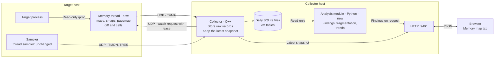

# Process memory map: design

Status: proposal. No code exists yet.

This document describes a new dashboard tab, **Memory map**. The tab shows the
virtual address space of the target process. It shows the heap, the stacks, the
libraries and all other mappings. The user can select one mapping and zoom in to
see its pages. The tab also reports memory pressure, fragmentation and other
virtual-memory problems.

The design needs **no privilege**. The sampler runs as the target user. It reads
only files that the same user can read.


The source of the picture is [mockups/process-memory-map.html](mockups/process-memory-map.html).
The mock-up uses invented numbers. Open the file in a browser to see it.

## 1. Background: the virtual address space

Each Linux process sees its own range of addresses. The kernel splits this range
into **VMAs** (virtual memory areas). A VMA is one block of addresses. All
addresses in one VMA have the same permissions and the same backing.

On x86-64 the usual layout is as follows. High addresses are at the top.

```text
high   [vsyscall] [vvar] [vdso]        kernel helpers
       [stack]                         main stack. Grows DOWN.
       ... large unmapped gap ...
       thread stacks                   fixed size. Do not grow.
       allocator arenas, big mmaps     anonymous memory
       libraries (code, data)          file-backed
       ... unmapped gap ...
       [heap]                          brk heap. Grows UP.
       data, bss
low    program code                    file-backed
```

Four terms matter for the rest of this document:

- **Mapped** means the kernel has a VMA for the address. It does not mean that
  RAM is in use.
- **Resident** means a page is in RAM now. The kernel gives RAM to a page only
  when the program first touches it.
- **Swapped** means the kernel moved the page to disk.
- **Dirty** means the program changed the page.

A process can map 18 GiB and use 2 GiB of RAM. The tab shows both numbers.

## 2. What the sampler can read without privilege

All sources below are readable by the same user. None of them needs `sudo`,
`CAP_SYS_PTRACE` or `ptrace` attach. See
[proc(5)](https://man7.org/linux/man-pages/man5/proc.5.html) and the
[pagemap guide](https://docs.kernel.org/admin-guide/mm/pagemap.html).

| Source | What it gives | Cost |
|---|---|---|
| `/proc/<pid>/maps` | Start, end, permissions, file offset, inode, path, names such as `[heap]` and `[stack]` | Low |
| `/proc/<pid>/smaps` | Per VMA: Size, Rss, Pss, shared and private pages, dirty pages, swap, huge pages, `VmFlags` (for example `gd` = grows down) | High. The kernel walks the page tables. |
| `/proc/<pid>/smaps_rollup` | The totals of `smaps` | Medium |
| `/proc/<pid>/pagemap` | Per page: present, swapped, exclusive, soft-dirty. The frame number is hidden without `CAP_SYS_ADMIN`. | Medium |
| `/proc/<pid>/status` | VmSize, VmRSS, RssAnon, RssFile, RssShmem, VmSwap, VmPTE, VmLck | Low |
| `/proc/<pid>/stat` | `minflt`, `majflt`, `startstack`, `vsize` | Low. The sampler reads it already. |
| `/proc/<pid>/limits` | RLIMIT_AS, RLIMIT_STACK, RLIMIT_MEMLOCK | Low |
| `/proc/sys/vm/max_map_count` | The maximum number of VMAs for one process | Low |
| `/proc/pressure/memory` and cgroup `memory.pressure` | Memory pressure (PSI). The sampler reads it already. | Low |
| `/proc/meminfo`, `/proc/vmstat`, `/proc/buddyinfo` | Host memory, reclaim and compaction counters, free blocks by order | Low |

### What the sampler cannot read without privilege

- **The bytes of the memory.** `/proc/<pid>/mem` and `process_vm_readv` need
  `ptrace` attach rights. Yama `ptrace_scope=1` blocks them. This version does
  not show bytes. It shows page state only.
- **The stack pointer.** The sampler cannot see how deep a thread is in its
  stack. It sees the resident part of the stack. This shows the deepest point
  that the thread reached (the high-water mark).
- **Physical addresses.** The sampler cannot see where a page is in RAM. It
  cannot measure the physical fragmentation of one process. It can measure the
  physical fragmentation of the host with `/proc/buddyinfo`.
- **The state of the allocator.** The sampler cannot see which heap bytes are
  live and which bytes the program freed. Heap fragmentation findings are
  therefore indicators, not proof.
- **Processes that are not dumpable.** The kernel gives these `/proc` files to
  root. The tab shows "no access" for them, not zero.

## 3. How the tab shows growth

The kernel does not announce growth. The sampler **reads `maps` again and
compares the two results**.

| Area | Direction | What changes | What the sampler sees |
|---|---|---|---|
| `[heap]` (brk) | Up | The end address of the VMA | The end address rises when the allocator calls `brk`. |
| `[stack]` (main) | Down | The start address of the VMA | The start address falls when the kernel expands the stack on a page fault. It never rises. |
| Thread stacks | None | The size is fixed (8 MiB by default). A guard page is below it. | The resident size rises as the thread goes deeper. |
| Allocator arenas and big `mmap` blocks | None | New VMAs appear. Others disappear. | VMA added and removed events. |

The change is in steps of whole pages. The tab shows a growth arrow and a
time chart for the end of the heap and the start of the stack.

glibc `malloc` uses `brk` only for the main arena. It uses `mmap` for large
blocks and for the arenas of other threads. The tab therefore shows the arenas
and the large maps next to the heap.

The sampler cannot name thread stacks with certainty. The kernel removed the
`[stack:tid]` label in Linux 4.5. The tab labels a block as a probable thread
stack when it is anonymous, `rw-p`, near the stack size limit, and has a guard
VMA below it.

## 4. Where the code runs

The project rules in [AGENTS.md](../AGENTS.md) apply:

- Fast and performance-critical code is C++ or Rust.
- The core collector does not get unrequested features.
- Analysis, reports and richer dashboard data are separate programs. They read
  SQLite read-only or use the HTTP API. They never read the UDP stream.
- `smaps` stays off the per-thread sampling path
  ([linux-monitoring.md](linux-monitoring.md)).

### Options

| Option | Description | Advantage | Disadvantage |
|---|---|---|---|
| **A. A thread in the sampler** | The sampler starts one extra thread when the feature is on. The thread reads `/proc` and sends `TVMA` datagrams. | One program to deploy. Same target lookup, same session, same UDP path. Works when the collector runs on another host. Summaries and evidence snapshots go to SQLite. | A bug in the new code can stop the thread sampler. The sampler is no longer single-threaded. |
| **B. A separate sampler program** | A new binary, like `socket_sampler/`. | The failure of one program does not stop the other. The user can limit it with `nice` or a cgroup. | One more program to deploy. It needs its own target lookup. |
| **C. A helper on the collector host, started on request** | Like `SocketReportBridge`. The HTTP thread starts a helper, which reads `/proc` once. | The user can select any range at any time. No new wire format. | The target must be on the same host. No history. Python or C++ start-up cost for each request. |

### Recommendation

Use **option A** for version 1, with these conditions:

1. The feature is **off by default**.
2. The new thread has bounded memory, bounded time and no exceptions. Fallible
   functions return `std::expected`.
3. The parsers are in headers under `common/`, not inside `sampler/main.cpp`. If
   the thread causes trouble, the code moves to option B with little change.
4. The thread backs off by itself when a read is slow (see section 11).

Option C is a possible later addition for local targets that need an arbitrary
zoom range.

## 5. Data flow



Each part has one job:

1. **The memory thread** reads facts. It does not judge them.
2. **The collector** stores the raw records. It keeps the latest snapshot in
   memory. It computes no findings.
3. **The analysis module** reads SQLite and computes findings. It runs in its own
   process, so a slow analysis cannot delay the collector.
4. **The browser** gets only the minimum for the live view: the latest snapshot
   and the changes since the last request. The browser asks for findings less
   often.

## 6. The sampler memory thread

The sampler starts the thread when `[memory_map] enabled = true`. The thread
then **blocks** until a request arrives. While it blocks, it uses no CPU and
reads nothing from the target.

### Control: the request channel

The thread waits in `poll()` on a control socket. The collector sends small UDP
requests to this socket.

| Field | Content |
|---|---|
| Action | `watch` or `stop` |
| Tier | `layout` (tiers 0 and 1) or `detail` (tier 2, see below) |
| Lease | Seconds. The sampler limits it to `max_lease_s` (default 15). |
| VMA start | For `detail` only. The start address of the selected VMA. |
| Counter | Rises with each request. The sampler ignores a request with an old counter. |
| HMAC | Computed with a shared token. |

Rules for the channel:

1. A request never holds a PID or a path. The target is always the process in
   `sampler.toml`. The only actions are the fixed list above.
2. The sampler accepts a request only from the configured collector address with
   a valid HMAC. It limits the request rate.
3. The default listen address is `127.0.0.1`. A remote collector needs an
   explicit address and a token file in `[memory_map]`.
4. The request has a **lease**. While a browser has the tab open, the collector
   repeats `watch` every 5 s. If the lease ends, the thread stops and blocks
   again. A forgotten tab cannot keep the sampling on.
5. The sampler sends no reply. The `TVMA` stream is the reply. The tab shows
   "waiting for the sampler" until the first datagram arrives.

This is the first inbound path to the sampler. The pull request that adds it
must include a short threat review. The worst case for an attacker who passes the
checks is a bounded read of the configured target.

Configuration keys: `enabled`, `listen`, `token_file`, `interval_s`,
`keyframe_s`, `max_vmas`, `max_lease_s`. A reload that changes only
`[memory_map]` must **not** start a new session. It only changes this thread.

On the collector side, a new setting, `sampler_control = "host:port"`, gives the
address of the control socket. The HTTP endpoint `POST /api/memory-map/watch`
sets the lease. The tab calls it while it is open.

### Three tiers of work

Each tier takes more of the target's memory-map lock (section 11).

| Tier | Reads | Runs when | Risk to the target |
|---|---|---|---|
| 0 | `status`, `stat`, `limits` | The lease is active | None. These reads take no `mmap_lock`. |
| 1 | `maps`, in small reads | The lease is active | Short lock holds |
| 2 | `smaps` and `pagemap` for **one** selected VMA | Only after the user selects the VMA | Short lock holds in a bounded burst |

Tiers 0 and 1 give the whole growth view: the end of the heap, the start of the
stack, the VMA list and the totals. Tier 2 gives the page grid of the selected
VMA. Tier 2 never runs on its own.

### One cycle

1. Tier 0: read `status`, `stat` (fault counters) and `limits`.
2. Tier 1: read `maps` in small `read` calls (default buffer: 4 KiB). Parse with
   a fixed buffer, without allocation in the loop.
3. Compare with the previous cycle. Mark each VMA as new, removed, resized or
   unchanged.
4. Tier 2, on request only: read `smaps` for the selected VMA. Read `pagemap` for
   its address range in small windows. Reduce the result to at most 512
   **cells**. One cell covers a fixed number of pages. It holds the fractions of
   resident, dirty and swapped pages.
5. Send datagrams. Do not retry. Do not buffer on disk.

Use `PROCMAP_QUERY` (Linux 6.11 and later) when the kernel has it. It returns one
VMA for an address, without text parsing. Keep the text parser as the fallback.

### Limits

| Limit | Default | Reason |
|---|---|---|
| `interval_s` | 2 | The growth of the heap is visible at this rate. |
| `keyframe_s` | 30 | A lost datagram is corrected within 30 s. |
| `max_vmas` | 8192 | Some processes have more than 60 000 VMAs. The sampler sends a summary and the largest VMAs, and sets a `truncated` flag. Tier 2 needs a confirmation above this number. |
| Read size | 4 KiB for `maps` | A small read holds the lock for a short time. |
| Slow-read limit | 2 ms | The thread times each read. A slow read doubles the sleep time. |
| Burst budget | 50 ms total | The thread stops a tier 2 burst above this time and sends what it has. |
| Cells per VMA | 512 | 512 cells fit in 2 datagrams. |

## 7. Transport: the `TVMA` datagram

Use a new format. Do not reuse the `TMON` or `TRES` fields
([linux-monitoring.md](linux-monitoring.md) requires this). Follow the pattern of
`common/resource_wire.hpp`: a fixed header, a version, and parts that share the
header.

Outline (the implementation pull request fixes the exact layout):

| Record | Content | Size |
|---|---|---|
| Header | Magic, version, session, sequence, timestamps, kind (keyframe or delta), part number, part count, `truncated` flag | 64 bytes |
| Summary | Values from `status`, `stat`, `limits`; VMA count; address range statistics | Fixed list of `u64` values. `kUnavailable` means "not readable". |
| VMA record | Start, end, offset, inode, permissions, `VmFlags` bits, kind, name identifier, Rss, Pss, private dirty, shared, swap, huge pages | About 80 bytes. About 14 per datagram. |
| Name record | Name identifier and path text | Short text. Sent when the name is new. |
| Cell record | VMA start, cell size in pages, 3 bytes per cell (resident, dirty, swapped) | 512 cells = about 1.5 KB |

UDP can lose datagrams. The design handles this in three ways:

1. A **keyframe** every `keyframe_s` seconds holds the complete state.
2. A **delta** holds only the new, removed and changed VMAs.
3. The collector marks a gap when it misses a sequence number. The tab shows
   "stale" until the next keyframe. A missing part never means "the VMA is
   gone".

## 8. The collector

The collector does three things. It does not interpret the data.

1. It decodes `TVMA` datagrams and reassembles the parts.
2. It writes **raw records** to SQLite (see below).
3. It keeps the **latest full snapshot** in memory and serves it with
   `GET /api/memory-map`.

`GET /api/memory-map?since=<sequence>` returns only the changes after the given
sequence. The live view is therefore small: one summary and a few VMA changes.

### SQLite tables

The tab is mostly live. The sampler reads only while someone watches, so the
database holds little. It keeps only important data:

| Table | One row for | Content |
|---|---|---|
| `vm_summary` | Each minute of watching | The summary values. About 100 bytes. |
| `vm_snapshot` | Each evidence snapshot | The full VMA list. The collector writes one at most each hour, and one when a finding opens. |
| `vm_name` | Each new name | Name identifier and path. |

The database holds **no page cells** and no continuous VMA history. The
retention is 7 days by default (setting: `memory_retention_days`).

Replay shows the stored snapshots and summaries. It is not a continuous record.

## 9. The analysis module

The module is a Python program in a new directory, `memory_analysis/`. It reads
the SQLite files in read-only mode and computes findings. This follows the rule
for reports and richer dashboard data. Python is optional. If the module is not
installed, the tab still shows the map and the numbers. It hides the findings
panel.

The collector starts the module through a bounded bridge, as it does for the
socket report. A slow or failed analysis cannot delay the UDP loop.

The thresholds below are defaults. All of them are settings.

| Finding | Source | Rule |
|---|---|---|
| VMA count near the limit | `maps` count, `vm.max_map_count` | Warn at 80 %. Critical at 90 %. At the limit, `mmap` fails with `ENOMEM`. |
| Address space near the limit | `VmSize`, RLIMIT_AS | Warn at 80 %. |
| Stack near its limit | `[stack]` size, RLIMIT_STACK | Warn at 50 %. Critical at 80 %. |
| Anonymous memory grows without a plateau | `RssAnon` over time | Slope is positive in at least 90 % of windows for 10 minutes and exceeds a minimum rate. This is a **suspicion** of a leak, not proof. |
| Memory pressure | PSI `some` and `full` for the host and the cgroup | `some` above 10 % is serious. Any `full` above 0 is serious. |
| Major page faults rise | `majflt` rate | The rate exceeds a multiple of the 1-hour median. |
| Swap in use | `VmSwap`, `pswpin`, `pswpout` | `VmSwap` above 0 and swap-in rate above 0. |
| Little room in the cgroup | `memory.current`, `memory.max`, `memory.events` | Above 90 % of the limit, or the `high`, `max` or `oom_kill` counters rise. (Add these fields to the resource sample if it does not have them.) |
| Sparse heap | `pagemap` cells of `[heap]` and arenas | Resident share below 60 % **and** many short resident runs. This is an **indicator** of fragmentation. |
| Many small VMAs | VMA size distribution | More than 50 % of the VMAs are 4 KiB to 64 KiB. This often means many guard pages or many tiny `mmap` calls. |
| Arena count | Anonymous 64 MiB regions | More than 8 times the CPU count. This matches the glibc default arena limit. |
| Stale library | Path ends with `(deleted)` | The process runs code that the package manager replaced. Restart it. |
| Writable and executable memory | Permissions `rwx` | Report it. JIT compilers cause it. Other programs should not. |
| Huge page trouble | `AnonHugePages`, `thp_*`, `compact_stall` | Compaction stalls rise while the process uses huge pages. |
| Host fragmentation | `/proc/buddyinfo` | Few free blocks of order 9 and above while memory is free. Huge page allocations will fail or stall. |

Notes for the reader:

- **Virtual fragmentation** is about the address space. It shows as many small
  VMAs and small gaps between them. It can cause `mmap` failures even when RAM
  is free.
- **Heap fragmentation** is about the allocator. Free memory is in many small
  pieces. The process uses more RSS than its live data needs. Without `ptrace`
  the tab can show only the indicator in the table above.
- **Physical fragmentation** is about RAM. It makes large contiguous
  allocations fail. The tab shows it for the host only.

## 10. The dashboard tab

The tab has four parts. See the mock-up.

1. **Tiles.** VmSize, RSS, RSS by type, VMA count, major faults, memory pressure.
2. **Findings.** A list with severity. Each finding explains the evidence in one
   or two sentences.
3. **Address space.** One bar for each VMA or group of VMAs, with high addresses
   at the top. The fill shows the resident share. Long gaps are shortened and
   labeled. Click a readable mapping to select it.
4. **Zoom.** The page grid of the selected VMA, with the facts and three time
   charts (end of heap, start of stack, resident anonymous memory).

Rules for the page:

- Use the existing colors and fonts of the dashboard. Do not load anything from
  the network.
- Do not use color alone. Each state also has a label or a pattern.
- Show "not readable" for unavailable data. Never show zero.
- Poll the live endpoint about once each 2 s only while the tab is open.

## 11. Observer effect: the memory-map lock

### What the lock is

Each process has one `mmap_lock`. It is a read/write lock on the list of VMAs.

- **Readers** share the lock. They are: page-fault handling on older kernels,
  and reads of `/proc/<pid>/maps`, `smaps` and `pagemap`.
- **Writers** need the lock alone. They are: `mmap`, `munmap`, `mprotect`, `brk`,
  `mremap` and stack growth.

A waiting writer blocks all new readers. The stall can therefore spread:

1. The sampler reads `smaps`. It holds the read lock.
2. A target thread calls `mmap`. It waits for the lock.
3. Other target threads page-fault. On older kernels, they queue behind the
   waiting writer.
4. The whole target stops for the time of step 1.

Userspace cannot ask for "try the lock". After a `read()` starts, the sampler
cannot stop it. The stall is the length of **one lock hold**, not of the whole
scan.

### How long a hold is

| Source | Lock hold |
|---|---|
| `status`, `stat`, `limits`, `statm` | No `mmap_lock`. |
| `maps` | Per `read()` call. The kernel takes the lock at the start of the call and drops it at the end. A small buffer means a short hold. Newer kernels reduce it more (per-VMA locks, `PROCMAP_QUERY`). |
| `smaps` | Per `read()` call. Each VMA entry is large, so a large buffer covers many VMAs. |
| `smaps_rollup` | The whole walk in one hold. **Never use it for large processes.** |
| `pagemap` | Windows of a limited address range. Verify the size on each supported kernel. |
| `clear_refs` | A write lock and extra page faults. **Never use it.** |

The kernel version changes the risk. Since Linux 6.4, most page faults use
per-VMA locks. Then only `mmap`, `munmap`, `brk` and similar writers wait. Older
enterprise kernels (for example 4.18 and 5.14) make every faulting thread wait.
The sampler reads the kernel version and uses stricter limits on old kernels.

Do not give the memory thread a very low priority (`SCHED_IDLE` or a high nice
value). If the kernel pauses the thread while it holds the lock, the target
stays blocked for the whole pause. Keep each read short. Sleep between reads.

### What the design promises

The sampler cannot read `maps`, `smaps` or `pagemap` with zero effect on the
target. The design gives three guarantees instead:

1. **No cost when nobody looks.** The thread blocks until a request arrives. The
   lease ends the work when the tab closes.
2. **A bound.** The tiers (section 6) keep the heavy reads for one selected VMA.
   Reads are small. The thread sleeps between them. A burst has a time budget.
3. **A measurement.** The thread times each read, because a read time shows the
   lock hold. It backs off when a read is slow. It sends the cost to the
   collector, and the tab shows it.

### Other safety rules

1. The thread never writes to the target.
2. A VMA can disappear between two reads. A process can exit. The thread treats
   `ENOENT`, `ESRCH` and `EIO` as normal results.
3. The zoom button shows a warning: "This briefly locks the target memory map."

### Acceptance test

A test target does `mmap`, `munmap` and page faults in a loop and records the
latency of each call. The memory thread reads `smaps` and `pagemap` at the same
time. The pull request for the sampler thread must report the extra latency at
p50, p99 and the maximum, on a 6.x kernel and on an older kernel. The project
sets the pass limit from these results.

## 12. Plan

Each step is a separate pull request. Each pull request builds and passes
`make check` alone.

1. **Parsers.** `maps`, `smaps`, `pagemap` and `status` parsers in `common/` with
   unit tests that use fixture text. No sampler change.
2. **`TVMA` wire format and request format.** Encoders and decoders with
   round-trip tests. The request has the HMAC.
3. **Sampler thread.** The `[memory_map]` configuration, the blocking thread, the
   control socket, the lease, the tiers, the read timing and back-off, and the
   rule that a `[memory_map]` reload keeps the session. Include the threat
   review and the **acceptance test** from section 11.
4. **Collector.** Decode, keep the snapshot, `sampler_control`,
   `POST /api/memory-map/watch`, `GET /api/memory-map` and the SQLite tables.
5. **Tab, version 1.** Tiles, address space bar, zoom grid and growth charts.
   No findings yet.
6. **Analysis module.** `memory_analysis/`, the bridge and the findings panel.
7. **Replay of snapshots.** Connect the tab to the time selector for the stored
   snapshots.

## 13. Decisions

The project owner made these decisions:

1. **Control channel.** The sampler gets a real-time request channel. The memory
   thread blocks until it receives a request (section 6).
2. **Defaults.** `interval_s` is 2 and `keyframe_s` is 30.
3. **Retention.** The tab is mostly live. The database keeps only summaries and
   evidence snapshots, for 7 days (section 8).
4. **Thread or program.** A thread in the sampler.

## 14. Limits of this design

- Without `ptrace` the tab shows page state, not bytes. It does not show stack
  depth.
- Thread-stack labels are a heuristic.
- Fragmentation findings are indicators.
- Kernel versions differ. `PROCMAP_QUERY` needs Linux 6.11. Some `VmFlags`
  names depend on the kernel.
- Containers, `hidepid` and non-dumpable processes can hide `/proc` files.
