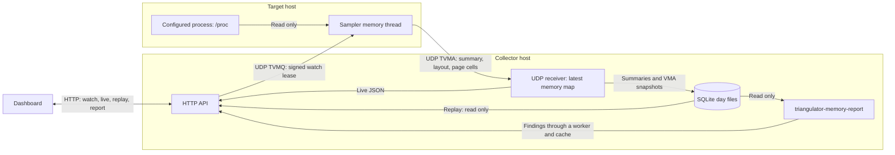

# Memory map: implementation overview

PR 34 adds an optional view of the target process address space. The feature
is off by default in both programs. A VMA is a virtual memory area.

1. **Start and stop.** While the section is visible in live mode, the dashboard
   calls `POST /api/memory-map/watch` every 5 s. The HTTP thread signs a request
   with HMAC-SHA256. The sampler checks the sender, signature and increasing
   counter. It reads only the configured target. The lease lasts at most 15 s
   by default. Without an active lease, the memory thread waits and reads nothing.
2. **Read and send.** By default, the memory thread reads `status`, `stat`,
   `limits` and `maps` every 2 s. Selecting one VMA also reads its `pagemap`.
   Reads use fixed buffers and pause after slow reads. A page scan has a 50 ms
   burst budget and at most 512 cells. A large scan continues in later cycles.
   The sampler sends a full layout when it changes and at least every 30 s.
3. **Live view and storage.** The collector publishes a layout only after all
   its UDP parts arrive. `GET /api/memory-map` serves the latest data. SQLite
   stores summaries at most once per minute. It stores the first complete layout
   of a watch, then at most one per hour. A gap over 60 s marks a new watch.
4. **Findings and replay.** A separate C++ program reads SQLite and computes
   findings. A bounded worker runs it outside the UDP loop; the API returns
   cached results. Trends also use `resource_sample` and `thread_rollup`.
   `GET /api/memory-map/replay?at=T` reads the latest stored summary and layout
   at or before `T`. Replay shows record ages. Page cells are not stored.

The address-space view shows VMA size. Only the selected VMA has page data.
Page cells show resident, swapped and shared fractions, with no dirty state.
The latency test on an older kernel remains open in PR 34.

Code: [sampler](../sampler/memory_map.hpp),
[collector](../collector/memory_map.hpp),
[API](../collector/http.hpp), [report](../metrics/memory_report.hpp),
[replay](../collector/memory_replay.hpp).
See the [full design](process-memory-map-design.md) for settings and limits.
