# Sampler

Read Linux thread and resource data. Send samples to the collector over UDP.

<p align="center">
  
</p>

## Quick start

Run these commands from the repository root as the target process user.

1. Start both programs:

   ```sh
   scripts/start.sh
   ```

2. Select a process name or PID:

   ```sh
   scripts/set-target.sh ghostty
   ```

3. Set the sample frequency:

   ```sh
   scripts/set-rate.sh 5
   ```

The default frequency is 1 Hz. The range is 0.2–10 Hz.

## Run separately

Use an existing local configuration:

```sh
make build/triangulator-sampler
build/triangulator-sampler --check-config config/local/sampler.toml
build/triangulator-sampler config/local/sampler.toml
```

Set `target_process` or `target_pid` in the configuration.
Send `SIGHUP` to apply configuration changes.

[Configuration example](../config/sampler.toml) ·
[Architecture](../docs/architecture.md) ·
[Resource data](../docs/resource-monitoring.md) ·
[Collector](../collector/README.md)
